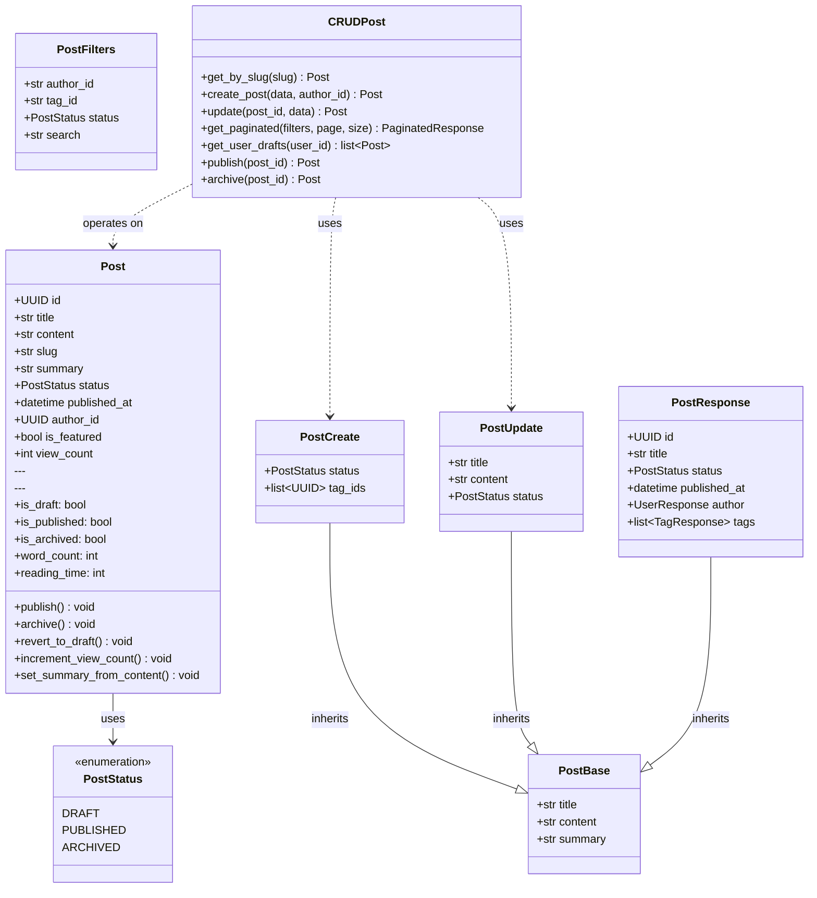
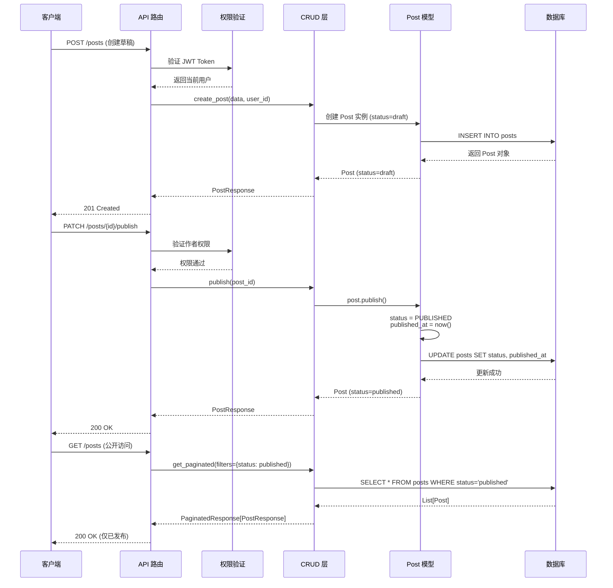

# Phase 6 - 文章管理模块架构设计

> **版本**: v1.0
> **最后更新**: 2025-10-16

---

## 📋 目录

1. [模块概述](#模块概述)
2. [架构设计](#架构设计)
3. [Phase 6.1 - 草稿系统设计](#phase-61---草稿系统设计)
4. [数据流与业务逻辑](#数据流与业务逻辑)

---

## 模块概述

### 业务目标
实现完整的文章生命周期管理系统，支持：
- ✅ **内容管理**：创建、编辑、删除文章
- ✅ **状态管理**：草稿、发布、归档三种状态
- ✅ **标签系统**：多对多关系，支持分类
- ✅ **权限控制**：作者/管理员分级权限
- ✅ **分页查询**：支持过滤、排序

### 技术栈
- **ORM**: SQLAlchemy 2.0+ (声明式映射)
- **数据验证**: Pydantic v2
- **API框架**: FastAPI
- **数据库**: PostgreSQL
- **迁移工具**: Alembic

---

## 架构设计

### Level 1: 代码级架构（Code Level）

展示各层的详细类结构和方法签名。

==TODO==  ❌ 错误：PostUpdate 和 PostFilters 继承 BaseModel， 不是继承PostBase！ PostBase也是继承BaseModel，没有画出来

### Level 2: 组件级架构（Component Level）

展示模块之间的依赖关系和数据流。

### Level 3: 请求处理流程（Sequence Diagram）

展示一次完整的文章发布流程。

---

---

## 参考资源

- [SQLAlchemy 2.0 Documentation](https://docs.sqlalchemy.org/en/20/)
- [FastAPI Best Practices](https://fastapi.tiangolo.com/tutorial/)
- [State Machine Pattern](https://refactoring.guru/design-patterns/state)
