# Phase 6 - 文章管理模块架构设计

> **版本**: v2.0 (Phase 6.1 - 草稿系统)
> **最后更新**: 2025-10-16

---

## 📋 目录

1. [模块概述](#模块概述)
2. [架构设计](#架构设计)
3. [Phase 6.1 - 草稿系统设计](#phase-61---草稿系统设计)
4. [数据流与业务逻辑](#数据流与业务逻辑)

---

## 模块概述

### 业务目标
实现完整的文章生命周期管理系统，支持：
- ✅ **内容管理**：创建、编辑、删除文章
- ✅ **状态管理**：草稿、发布、归档三种状态
- ✅ **标签系统**：多对多关系，支持分类
- ✅ **权限控制**：作者/管理员分级权限
- ✅ **分页查询**：支持过滤、排序

### 技术栈
- **ORM**: SQLAlchemy 2.0+ (声明式映射)
- **数据验证**: Pydantic v2
- **API框架**: FastAPI
- **数据库**: PostgreSQL
- **迁移工具**: Alembic

---

## 架构设计

### Level 1: 代码级架构（Code Level）

展示各层的详细类结构和方法签名。

==TODO==  ❌ 错误：PostUpdate 和 PostFilters 继承 BaseModel， 不是继承PostBase！ PostBase也是继承BaseModel，没有画出来


### Level 2: 组件级架构（Component Level）

展示模块之间的依赖关系和数据流。

```mermaid
flowchart TB
    subgraph "API 路由层 (api/v1/endpoints/posts.py)"
        A1["POST /posts - 创建文章"]
        A2["GET /posts - 文章列表"]
        A3["GET /posts/{id} - 文章详情"]
        A4["PATCH /posts/{id} - 更新文章"]
        A5["DELETE /posts/{id} - 删除文章"]
        A6["GET /posts/drafts - 草稿列表"]
        A7["PATCH /posts/{id}/publish - 发布"]
        A8["PATCH /posts/{id}/archive - 归档"]
    end

    subgraph "Schema 验证层 (schemas/post.py)"
        B1["PostCreate - 创建验证"]
        B2["PostUpdate - 更新验证"]
        B3["PostResponse - 响应格式"]
        B4["PostFilters - 查询过滤"]
    end

    subgraph "CRUD 业务层 (crud/post.py)"
        C1["CRUDPost.create_with_author"]
        C2["CRUDPost.get_paginated"]
        C3["CRUDPost.update"]
        C4["CRUDPost.get_user_drafts"]
        C5["CRUDPost.publish"]
        C6["CRUDPost.archive"]
    end

    subgraph "数据模型层 (models/post.py)"
        D1["Post Model"]
        D2["PostStatus Enum"]
        D3["业务方法: publish/archive/revert_to_draft"]
    end

    subgraph "数据库层"
        E1[("PostgreSQL")]
    end

    %% 数据流
    A1 --> B1 --> C1 --> D1 --> E1
    A2 --> B4 --> C2 --> D1 --> E1
    A3 --> C2 --> D1 --> E1
    A4 --> B2 --> C3 --> D1 --> E1
    A6 --> C4 --> D1 --> E1
    A7 --> C5 --> D3 --> E1
    A8 --> C6 --> D3 --> E1

    %% 返回流
    E1 -.-> D1 -.-> B3 -.-> A1
```



### Level 3: 请求处理流程（Sequence Diagram）

展示一次完整的文章发布流程。

```mermaid
sequenceDiagram
    participant Client as 客户端
    participant API as API 路由
    participant Auth as 权限验证
    participant CRUD as CRUD 层
    participant Model as Post 模型
    participant DB as 数据库

    %% 创建草稿
    Client->>API: POST /posts (创建草稿)
    API->>Auth: 验证 JWT Token
    Auth-->>API: 返回当前用户
    API->>CRUD: create_with_author(data, user_id)
    CRUD->>Model: 创建 Post 实例 (status=draft)
    Model->>DB: INSERT INTO posts
    DB-->>Model: 返回 Post 对象
    Model-->>CRUD: Post (status=draft)
    CRUD-->>API: PostResponse
    API-->>Client: 201 Created

    %% 发布文章
    Client->>API: PATCH /posts/{id}/publish
    API->>Auth: 验证作者权限
    Auth-->>API: 权限通过
    API->>CRUD: publish(post_id)
    CRUD->>Model: post.publish()
    Model->>Model: status = PUBLISHED<br/>published_at = now()
    Model->>DB: UPDATE posts SET status, published_at
    DB-->>Model: 更新成功
    Model-->>CRUD: Post (status=published)
    CRUD-->>API: PostResponse
    API-->>Client: 200 OK

    %% 查询已发布文章列表
    Client->>API: GET /posts (公开访问)
    API->>CRUD: get_paginated(filters={status: published})
    CRUD->>DB: SELECT * FROM posts WHERE status='published'
    DB-->>CRUD: List[Post]
    CRUD-->>API: PaginatedResponse[PostResponse]
    API-->>Client: 200 OK (仅已发布)
```



---

## Phase 6.1 - 草稿系统设计

### 业务目标
实现文章生命周期的完整状态管理：**草稿 → 发布 → 归档**，支持状态回退。

### 核心设计

#### 1. 状态机设计

```mermaid
stateDiagram-v2
    [*] --> DRAFT: 创建文章
    DRAFT --> PUBLISHED: 发布
    PUBLISHED --> DRAFT: 撤回编辑
    PUBLISHED --> ARCHIVED: 归档
    ARCHIVED --> PUBLISHED: 恢复发布
    ARCHIVED --> DRAFT: 恢复为草稿
    DRAFT --> ARCHIVED: 直接归档
    ARCHIVED --> [*]: 删除
```



#### 2. 数据模型变更

**Post 模型扩展** (已完成):
```python
class Post(Base):
    # 状态字段
    status: Mapped[PostStatus] = mapped_column(
        SQLEnum(PostStatus),
        default=PostStatus.DRAFT,  # 默认为草稿
        index=True
    )

    # 发布时间
    published_at: Mapped[datetime | None] = mapped_column(
        DateTime(timezone=True),
        default=None,  # 仅发布后设置
        index=True
    )

    # 业务方法
    def publish(self) -> None:
        """发布文章"""
        self.status = PostStatus.PUBLISHED
        if not self.published_at:
            self.published_at = datetime.now()

    def archive(self) -> None:
        """归档文章"""
        self.status = PostStatus.ARCHIVED

    def revert_to_draft(self) -> None:
        """恢复为草稿"""
        self.status = PostStatus.DRAFT
        self.published_at = None
```

#### 3. 待实现功能清单

##### Schema 层扩展
- [x] 更新 `PostCreate`：支持指定初始 status (默认 draft) ✅ 2025-10-17
- [x] 更新 `PostUpdate`：允许修改 status ✅ 2025-10-17
- [x] 新增 `PostPublish`：发布草稿专用 Schema (可选) ✅ 2025-10-17

##### CRUD 层扩展
- [x] `get_user_drafts(user_id, db)`: 获取用户草稿列表 ✅ 2025-10-17
- [x] `publish(post_id, db)`: 发布草稿 (调用 post.publish()) ✅ 2025-10-17
- [x] `archive(post_id, db)`: 归档文章 (调用 post.archive()) ✅ 2025-10-17
- [x] revert_to_draft: 调用 post.revert_to_draft() 业务方法恢复为草稿 ✅ 2025-10-17
- [x] 更新 `get_paginated()`: 支持 status 过滤 ✅ 2025-10-17

##### API 端点扩展
- [x] `GET /posts/drafts`: 查看我的草稿列表 (需认证) ✅ 2025-10-17
- [x] `POST /posts/`: 创建文章 (默认 status=draft) ✅ 2025-10-17
- [ ] `PATCH /posts/{id}/publish`: 发布草稿 (需作者权限)
- [ ] `PATCH /posts/{id}/archive`: 归档文章 (需作者权限)
- [ ] 更新 `GET /posts/`: 只返回 status=published (公开访问)

##### 权限控制规则
```python
# 查看权限
- 已发布文章: 所有人可见
- 草稿/归档: 仅作者和管理员可见

# 操作权限
- 发布/归档: 仅作者本人
- 删除: 仅作者本人或管理员
```

#### 4. 数据库迁移

**Alembic 迁移脚本** (待创建):
```python
# alembic/versions/xxx_add_draft_system.py
def upgrade():
    # status 字段已存在，无需修改
    # published_at 字段已存在，无需修改
    pass

def downgrade():
    pass
```

> 注意：`status` 和 `published_at` 字段在 Phase 4 已创建，本次无需迁移。

---

## 数据流与业务逻辑

### 核心业务场景

#### 场景 1: 创建并发布文章

```mermaid
flowchart TD
    A["用户创建文章"] --> B["POST /posts<br/>(status=draft)"]
    B --> C["保存为草稿"]
    C --> D["用户预览/编辑"]
    D --> E{"内容确认?"}
    E -->|继续编辑| D
    E -->|确认发布| F["PATCH /posts/{id}/publish"]
    F --> G["更新 status=published<br/>设置 published_at"]
    G --> H["文章公开可见"]
```



#### 场景 2: 撤回已发布文章

```mermaid
flowchart TD
    A["文章已发布"] --> B["发现需要修改"]
    B --> C["PATCH /posts/{id}<br/>(status=draft)"]
    C --> D["文章变为草稿<br/>对外隐藏"]
    D --> E["修改内容"]
    E --> F["重新发布"]
    F --> G["文章再次公开"]
```



#### 场景 3: 归档过时文章

```mermaid
flowchart TD
    A["文章已发布"] --> B["内容过时"]
    B --> C["PATCH /posts/{id}/archive"]
    C --> D["status=archived<br/>对外隐藏"]
    D --> E{"后续处理?"}
    E -->|恢复| F["PATCH /posts/{id}<br/>(status=published)"]
    E -->|修改| G["PATCH /posts/{id}<br/>(status=draft)"]
    E -->|删除| H["DELETE /posts/{id}"]
```



### 权限控制矩阵

| 操作 | 公开访问 | 已登录用户 | 文章作者 | 管理员 |
|------|---------|-----------|---------|--------|
| 查看已发布文章 | ✅ | ✅ | ✅ | ✅ |
| 查看草稿 | ❌ | ❌ | ✅ | ✅ |
| 查看归档文章 | ❌ | ❌ | ✅ | ✅ |
| 创建文章 | ❌ | ✅ | ✅ | ✅ |
| 编辑文章 | ❌ | ❌ | ✅ | ✅ |
| 发布草稿 | ❌ | ❌ | ✅ | ✅ |
| 归档文章 | ❌ | ❌ | ✅ | ✅ |
| 删除文章 | ❌ | ❌ | ✅ | ✅ |

---

## 技术要点

### 1. 状态转换幂等性

```python
# 示例：重复发布操作应该幂等
def publish(self) -> None:
    if self.status == PostStatus.PUBLISHED:
        return  # 已发布，无需操作

    self.status = PostStatus.PUBLISHED
    if not self.published_at:  # 仅首次发布时设置
        self.published_at = datetime.now()
```

### 2. 查询优化

```python
# 公开文章列表：只查询已发布
def get_public_posts(db: Session, page: int, size: int):
    return db.query(Post).filter(
        Post.status == PostStatus.PUBLISHED
    ).offset((page - 1) * size).limit(size).all()

# 作者草稿列表：按更新时间倒序
def get_user_drafts(db: Session, user_id: UUID):
    return db.query(Post).filter(
        Post.author_id == user_id,
        Post.status == PostStatus.DRAFT
    ).order_by(Post.updated_at.desc()).all()
```

### 3. 权限装饰器设计

```python
# 伪代码示例
def require_author_permission(post_id: UUID, current_user: User):
    """验证当前用户是否为文章作者"""
    post = get_post(post_id)
    if post.author_id != current_user.id and not current_user.is_admin:
        raise HTTPException(status_code=403, detail="无权限")
    return post
```

---

## 未来扩展方向

### Phase 6.2+ 计划功能
- [ ] **点赞系统**：PostLike 模型
- [ ] **收藏系统**：PostFavorite 模型
- [ ] **统计面板**：作者数据看板
- [ ] **通知系统**：评论/点赞通知
- [ ] **定时发布**：scheduled_at 字段
- [ ] **版本历史**：PostVersion 模型
- [ ] **协作编辑**：多人编辑锁机制

---

## 参考资源

- [SQLAlchemy 2.0 Documentation](https://docs.sqlalchemy.org/en/20/)
- [FastAPI Best Practices](https://fastapi.tiangolo.com/tutorial/)
- [State Machine Pattern](https://refactoring.guru/design-patterns/state)
