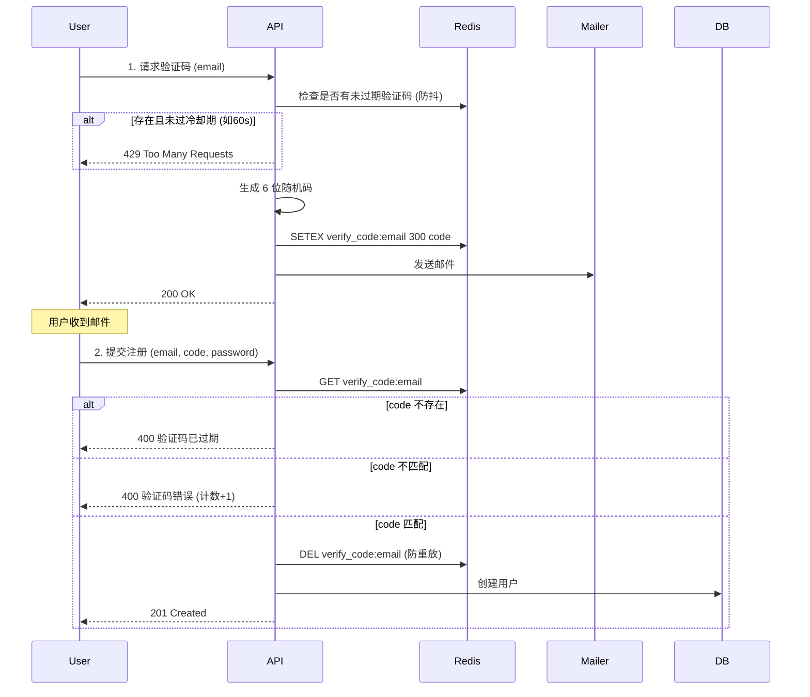

# 认证流程与技术细节补充

> **学习目标**：深入理解无状态认证架构的本质，掌握验证码系统的高可用与安全设计，以及 JWT 认证体系中的高级实践细节。

## 📚 目录

1. [无状态认证 (Stateless Authentication) 深度解析](#1-无状态认证-stateless-authentication-深度解析)
2. [验证码系统的架构与安全设计](#2-验证码系统的架构与安全设计)
3. [注册流程的事务与一致性](#3-注册流程的事务与一致性)
4. [JWT 高级实践补充](#4-jwt-高级实践补充)

---

## 1. 无状态认证 (Stateless Authentication) 深度解析

### 1.1 本质区别：状态存储在哪里？

在 Web 架构中，“状态”主要指用户的登录信息（Who is this user?）。

*   **有状态 (Stateful - Session)**：服务器在内存或数据库中**记住了**用户。
    *   *比喻*：你去餐厅，服务员（服务器）认得你的脸，记住了你坐在 3 号桌，点过什么菜。
    *   *瓶颈*：如果服务员换班了（请求打到了另一台服务器），新服务员完全不认识你。

*   **无状态 (Stateless - JWT)**：服务器**什么都不记**。
    *   *比喻*：你去游乐园，买了一张票（Token）。不管你去哪个游乐设施，检票员（服务器）只认票，不认人。检票员不需要知道你之前玩过什么，只要票是真的且没过期，就让你通过。

### 1.2 架构层面的优势

1.  **水平扩展 (Horizontal Scaling)**：
    *   这是无状态认证最大的优势。
    *   在微服务或负载均衡场景下，用户的前一个请求可能打到 `Server A`，后一个请求打到 `Server B`。
    *   如果是 Session 模式，`Server B` 必须去共享存储（如 Redis）里查 Session，或者配置“粘性会话”（Sticky Session，强行让用户由于一直连 `Server A`）。
    *   如果是 JWT 模式，`Server B` 拿到 Token 后，直接用本地的公钥/密钥解密验证即可，**完全不需要查询数据库或缓存**（除非做黑名单）。这意味着理论上服务器可以无限加，验证性能呈线性增长。

2.  **容错性 (Fault Tolerance)**：
    *   如果存储 Session 的 Redis 挂了，所有在线用户瞬间全部掉线。
    *   JWT 模式下，认证逻辑在应用代码里，只要应用服务还在跑，就能持续验证 Token。

3.  **RESTful 原则**：
    *   REST 架构风格明确要求服务器是无状态的。每个请求必须包含处理该请求所需的所有信息。JWT 完美契合这一原则。

---

## 2. 验证码系统的架构与安全设计

我们在 `auth.py` 中实现的验证码功能，看似简单，实则包含多个关键的安全设计点。

### 2.1 存储架构 (Redis vs DB)

为什么验证码必须存 Redis 而不是 PostgreSQL？

1.  **高频读写**：验证码生命周期极短（如 5 分钟），且属于高频写入数据。如果存入 PostgreSQL，会产生大量短暂的行记录，导致数据库频繁进行写盘和清理（VACUUM），影响主业务性能。
2.  **自动过期 (TTL)**：Redis 原生支持 `EXPIRE`，数据过期自动删除。数据库通常需要写定时任务（Cron Job）来清理过期数据，维护成本高。
3.  **性能要求**：验证码校验是注册/登录的第一道门槛，必须极快（毫秒级），Redis 的内存操作性能远超磁盘数据库。

### 2.2 完整的生命周期

### 2.3 安全防御策略

1.  **防暴力破解 (Brute-force Protection)**：
    *   6 位数字只有 100 万种组合。如果攻击者每秒尝试 1000 次，15 分钟就能试出来。
    *   **策略**：限制错误尝试次数。在 Redis 中记录 `verify_try:email`，每错误一次加 1，超过 5 次直接锁定该邮箱的验证功能 30 分钟。

2.  **防短信/邮件轰炸 (Rate Limiting)**：
    *   攻击者可能利用你的接口疯狂给别人发垃圾邮件。
    *   **策略**：发送间隔限制（冷却期）。用户请求验证码后，Redis 设置一个 60 秒的 `send_limit:email` 键。在这 60 秒内，再次请求直接拒绝。

3.  **防重放 (Anti-Replay)**：
    *   **策略**：验证码一旦验证通过（Verify Success），**必须立即删除**。绝对不能让同一个验证码被使用两次（比如注册两个账号）。

---

## 3. 注册流程的事务与一致性

在注册逻辑中，我们涉及两个异构数据源的操作：
1.  **Redis**：删除验证码
2.  **PostgreSQL**：创建用户

这里存在一个分布式一致性的微小风险：

**场景**：
1.  验证码校验通过。
2.  **Redis 删除验证码成功**。
3.  程序准备写数据库。
4.  **突然断电/数据库报错/用户名冲突**。
5.  数据库回滚，用户没创建成功。

**后果**：
用户发现注册失败了，想重试，结果发现**验证码无效了**（因为 Redis 里已经删了）。用户必须重新申请验证码。

**解决方案**：
虽然这是个 Bug，但对于“注册”这种非高频、非资金类业务，这种“用户体验的小瑕疵”通常是**可接受的**。
*   **Best Effort**：先写数据库，成功后再删 Redis？不行，如果写库成功但删 Redis 失败，用户就能用同一个码注册第二次（防重放失效）。
*   **结论**：**先防重放（删 Redis），再写库**。如果写库失败，让用户重新获取验证码。安全优先级 > 用户体验优先级。

---

## 4. JWT 高级实践补充

### 4.1 为什么 JWT 无法“真正”撤销？

JWT 的设计初衷就是“去中心化验证”。一旦服务器签发了 Token，它就像一张发出去的纸质门票。只要门票没过期、签名没被改，检票员（任何验证服务）都必须认。服务器手里没有“作废章”。

### 4.2 黑名单机制 (Blacklist) - 妥协的艺术

为了实现“注销”或“强制下线”，我们不得不引入状态。

*   **原理**：虽然我不能修改发出去的 Token，但我可以在检票口放一个“黑名单”。
*   **实现**：
    1.  用户点“注销”。
    2.  服务器解析 Token，拿到过期时间 `exp` 和唯一 ID `jti`。
    3.  将 `jti` 存入 Redis，Key 为 `blacklist:token:{jti}`，**TTL 设置为 Token 的剩余有效期**。
    4.  验证中间件每次收到 Token，先算签名，再查 Redis 黑名单。如果在名单里，直接拒收。
*   **优化**：为什么 TTL 是剩余有效期？因为一旦 Token 自然过期，它自己就无效了，黑名单里也没必要存了。这样可以保证 Redis 永远只存很少量的数据。

### 4.3 Refresh Token Rotation (令牌轮转)

为了安全，Access Token 有效期通常很短（如 15 分钟）。为了不让用户每 15 分钟登一次，我们用 Refresh Token。

**进阶安全策略：轮转 (Rotation)**
*   每次使用 Refresh Token 换取新的 Access Token 时，**同时也颁发一个新的 Refresh Token**，并将旧的 Refresh Token 作废。
*   **好处**：如果攻击者偷到了你的 Refresh Token，他只能用一次。当合法用户也尝试刷新时，服务器发现同一个旧 Refresh Token 被用了两次，说明可能被盗，直接**作废该用户及其所有 Token**，强制重新登录。这是极高安全级别的检测机制。
