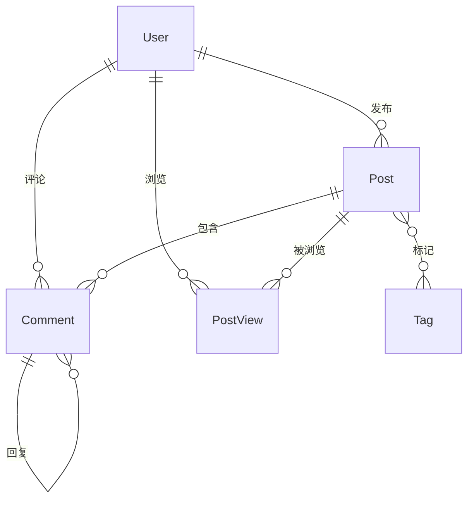

# 博客系统数据库设计

## 📋 需求分析

### 功能需求
- 👤 用户系统：管理员 + 普通用户（统一表管理）
- 📝 文章管理：发布、编辑、删除
- 💬 评论系统：支持层级结构
- 👀 浏览记录：用户-文章浏览记录
- 🏷️ 标签系统：文章分类

### 设计原则
- 使用 UUID 作为主键
- 用户表统一管理管理员和普通用户
- 用户-文章浏览记录用单独的表
- 评论支持层级结构

## 🔍 实体识别

从需求中提取的核心实体：
- **User** - 用户（管理员+普通用户）
- **Post** - 文章
- **Comment** - 评论
- **Tag** - 标签
- **PostView** - 浏览记录

## 📊 实体关系图



## 🤔 关键关系分析

### 1. User ↔ Post （一对多）
- 一个用户可以发布多篇文章
- 一篇文章只能有一个作者

### 2. Post ↔ Tag （多对多）
- 一篇文章可以有多个标签
- 一个标签可以标记多篇文章
- 需要中间表：post_tags

### 3. Comment 自关联（一对多）
- 评论可以回复评论（层级结构）
- parent_id 指向父评论

### 4. User ↔ PostView （一对多）
- 用户浏览文章的记录
- 支持浏览统计和个性化推荐

## 🔑 主键策略：为什么选择UUID

### UUID的优势
1. **分布式友好** - 不依赖数据库自增
2. **安全性** - 不暴露数据量信息
3. **迁移便利** - 跨系统唯一

### UUID的代价
- 存储空间更大（36字符 vs 数字）
- 索引性能略差
- URL不够简洁

### 结论
对于学习项目，UUID能让我们体验现代分布式系统的设计模式，代价可以接受。

## 📋 User表字段设计

### 核心字段说明

```python
class User(Base):
    __tablename__ = "users"

    # 主键
    id: UUID = Field(primary_key=True, default=uuid4)

    # 登录凭证
    username: str = Field(unique=True, index=True, max_length=50)
    email: str = Field(unique=True, index=True, max_length=100)
    password_hash: str = Field(max_length=255)  # 存储哈希值，不存明文

    # 基本信息
    nickname: str = Field(max_length=50)
    avatar: Optional[str] = Field(max_length=255)  # 存储文件路径

    # 权限和状态
    role: UserRole = Field(default=UserRole.USER)  # 枚举：USER/ADMIN
    is_active: bool = Field(default=True)      # 账户启用状态
    is_verified: bool = Field(default=False)   # 邮箱验证状态

    # 时间戳
    created_at: datetime = Field(default_factory=datetime.utcnow)
    updated_at: datetime = Field(default_factory=datetime.utcnow)
    last_login: Optional[datetime] = None
```

### 设计要点

1. **主键选择**：UUID保证全局唯一，支持分布式
2. **登录方式**：支持用户名和邮箱登录
3. **密码安全**：存储哈希值，使用bcrypt加密
4. **状态管理**：`is_active`用于软删除，`is_verified`控制注册流程
5. **角色权限**：枚举类型，当前支持普通用户和管理员
6. **扩展策略**：遵循YAGNI原则，需要时用Alembic添加字段

## 🎯 下一步：其他表设计

- Post表的字段设计
- Comment表的字段设计
- Tag表的字段设计
- PostView表的字段设计
- 中间表post_tags的设计