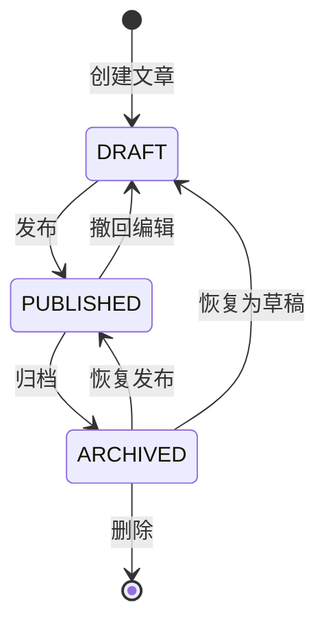
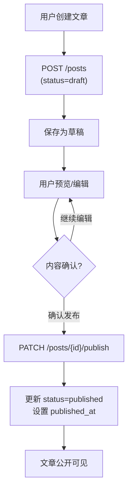
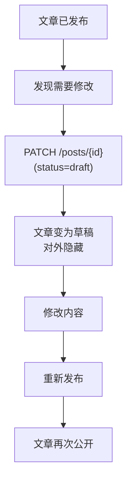
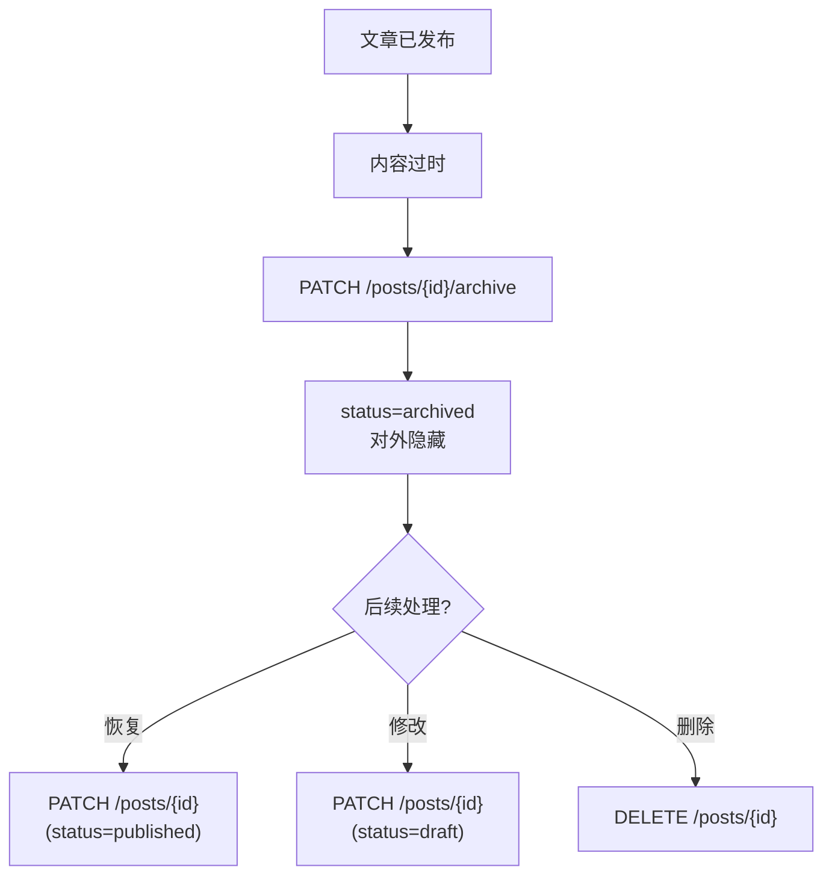

## Phase 6.1 - 草稿系统设计

### 业务目标
实现文章生命周期的完整状态管理：**草稿 → 发布 → 归档**，支持状态回退。

### 核心设计

#### 1. 状态机设计



#### 2. 数据模型变更

**Post 模型扩展** (已完成):
```python
class Post(Base):
    # 状态字段
    status: Mapped[PostStatus] = mapped_column(
        SQLEnum(PostStatus),
        default=PostStatus.DRAFT,  # 默认为草稿
        index=True
    )

    # 发布时间
    published_at: Mapped[datetime | None] = mapped_column(
        DateTime(timezone=True),
        default=None,  # 仅发布后设置
        index=True
    )

    # 业务方法
    def publish(self) -> None:
        """发布文章"""
        self.status = PostStatus.PUBLISHED
        if not self.published_at:
            self.published_at = datetime.now()

    def archive(self) -> None:
        """归档文章"""
        self.status = PostStatus.ARCHIVED

    def revert_to_draft(self) -> None:
        """恢复为草稿"""
        self.status = PostStatus.DRAFT
        self.published_at = None
```

#### 3. 待实现功能清单

##### Schema 层扩展
- [x] 更新 `PostCreate`：支持指定初始 status (默认 draft) ✅ 2025-10-17
- [x] 更新 `PostUpdate`：允许修改 status ✅ 2025-10-17
- [x] 新增 `PostPublish`：发布草稿专用 Schema (可选) ✅ 2025-10-17

##### CRUD 层扩展
- [x] `get_user_drafts(user_id, db)`: 获取用户草稿列表 ✅ 2025-10-17
- [x] `publish(post_id, db)`: 发布草稿 (调用 post.publish()) ✅ 2025-10-17
- [x] `archive(post_id, db)`: 归档文章 (调用 post.archive()) ✅ 2025-10-17
- [x] revert_to_draft: 调用 post.revert_to_draft() 业务方法恢复为草稿 ✅ 2025-10-17
- [x] 更新 `get_paginated()`: 支持 status 过滤 ✅ 2025-10-17

##### API 端点扩展
- [x] `GET /posts/drafts`: 查看我的草稿列表 (需认证) ✅ 2025-10-17
- [x] `POST /posts/`: 创建文章 (默认 status=draft) ✅ 2025-10-17
- [ ] `PATCH /posts/{id}/publish`: 发布草稿 (需作者权限)
- [ ] `PATCH /posts/{id}/archive`: 归档文章 (需作者权限)
- [ ] 更新 `GET /posts/`: 只返回 status=published (公开访问)

##### 权限控制规则
```python
# 查看权限
- 已发布文章: 所有人可见
- 草稿/归档: 仅作者和管理员可见

# 操作权限
- 发布/归档: 仅作者本人
- 删除: 仅作者本人或管理员
```

#### 4. 数据库迁移

**Alembic 迁移脚本** (待创建):
```python
# alembic/versions/xxx_add_draft_system.py
def upgrade():
    # status 字段已存在，无需修改
    # published_at 字段已存在，无需修改
    pass

def downgrade():
    pass
```

> 注意：`status` 和 `published_at` 字段在 Phase 4 已创建，本次无需迁移。

---

## 数据流与业务逻辑

### 核心业务场景

#### 场景 1: 创建并发布文章



#### 场景 2: 撤回已发布文章



#### 场景 3: 归档过时文章



### 权限控制矩阵

| 操作 | 公开访问 | 已登录用户 | 文章作者 | 管理员 |
|------|---------|-----------|---------|--------|
| 查看已发布文章 | ✅ | ✅ | ✅ | ✅ |
| 查看草稿 | ❌ | ❌ | ✅ | ✅ |
| 查看归档文章 | ❌ | ❌ | ✅ | ✅ |
| 创建文章 | ❌ | ✅ | ✅ | ✅ |
| 编辑文章 | ❌ | ❌ | ✅ | ✅ |
| 发布草稿 | ❌ | ❌ | ✅ | ✅ |
| 归档文章 | ❌ | ❌ | ✅ | ✅ |
| 删除文章 | ❌ | ❌ | ✅ | ✅ |

---

## 技术要点

### 1. 状态转换幂等性

```python
# 示例：重复发布操作应该幂等
def publish(self) -> None:
    if self.status == PostStatus.PUBLISHED:
        return  # 已发布，无需操作

    self.status = PostStatus.PUBLISHED
    if not self.published_at:  # 仅首次发布时设置
        self.published_at = datetime.now()
```

### 2. 查询优化

```python
# 公开文章列表：只查询已发布
def get_public_posts(db: Session, page: int, size: int):
    return db.query(Post).filter(
        Post.status == PostStatus.PUBLISHED
    ).offset((page - 1) * size).limit(size).all()

# 作者草稿列表：按更新时间倒序
def get_user_drafts(db: Session, user_id: UUID):
    return db.query(Post).filter(
        Post.author_id == user_id,
        Post.status == PostStatus.DRAFT
    ).order_by(Post.updated_at.desc()).all()
```

### 3. 权限装饰器设计

```python
# 伪代码示例
def require_author_permission(post_id: UUID, current_user: User):
    """验证当前用户是否为文章作者"""
    post = get_post(post_id)
    if post.author_id != current_user.id and not current_user.is_admin:
        raise HTTPException(status_code=403, detail="无权限")
    return post
```

---
