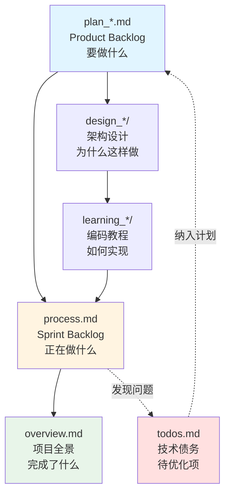

# 项目管理文档说明

> 本目录是项目的**管理控制中心**，采用敏捷开发的文档体系，帮助你快速了解项目状态、规划任务和追踪进度。

---

## 📚 核心文件说明

本目录包含 3 个核心文件 + 2 个计划文件，各司其职：

### 1️⃣ overview.md - 项目全景图 🌍

**职责**：记录项目所有已完成功能概览（前后端）

**内容**：
- ✅ 已完成的功能清单（按 Phase 分组）
- 📍 当前正在进行的 Phase
- 🎯 核心技术点和亮点
- 📊 项目结构说明

**更新时机**：Phase 完成后

**典型内容**：
```markdown
## ✅ 已完成后端功能清单
### Phase 1-2：基础设施 ✅
- ✅ SQLAlchemy 模型
- ✅ 数据库配置和迁移

### Phase 6：社交功能 ✅
- ✅ 通知系统（事件驱动、智能聚合）
...
```

**使用场景**：
- 新成员了解项目进展
- 向他人介绍项目
- 回顾项目历程

---

### 2️⃣ plan_backend.md - 后端产品待办列表 📋

**职责**：后端开发的 Product Backlog（要做什么）

**内容**：
- 🎯 Phase 目标和验收标准
- 📝 详细任务清单（L1/L2/L3 层级）
- ⏱️ 预估工作量
- 🔑 技术要点
- ✅ 完成状态标记

**更新时机**：Phase 开始前制定，子任务完成时更新状态

**典型内容**：
```markdown
### 🎯 Phase 6.4 - 通知系统 + 关注功能

**目标**：实现事件驱动的通知系统

**核心交付**：
- [ ] Follow 模型 + CRUD
- [ ] Notification 模型 + CRUD（含聚合）
- [ ] API 端点实现
- [ ] 事件驱动集成

**验收标准**：
- ✅ 点赞/评论/关注后自动触发通知
- ✅ 通知聚合正确
- ✅ 测试覆盖率 ≥ 85%

**预估工作量**：3-4 天
```

**使用场景**：
- Phase 开始前规划任务
- 了解下一步要做什么
- 评估工作量

---

### 3️⃣ plan_frontend.md - 前端产品待办列表 📋

**职责**：前端开发的 Product Backlog（要做什么）

**内容**：与 `plan_backend.md` 相同，但针对前端开发

**典型内容**：
```markdown
### Phase 1.1：Vue 3 基础（Day 1-2）

**目标**：掌握 Vue 3 核心概念，搭建项目基础

**核心交付**：
- [ ] 开发环境搭建（Vite + TypeScript）
- [ ] 基础布局组件（Header、Footer）
- [ ] 留白任务：PostCard 组件

**验收标准**：
- ✅ 运行开发服务器成功
- ✅ 理解响应式系统和组件通信
- ✅ 独立完成 PostCard 组件

**参考文档**：
- 设计：`docs/design_frontend/phase1_架构设计.md`
- 教程：`docs/learning_frontend/phase1_vue3_basics.md`

**预估工作量**：8-10 小时（2天）
```

**使用场景**：
- 前端 Phase 开始前规划任务
- 学习路径规划

---

### 4️⃣ process.md - 当前开发进展 🔄

**职责**：Sprint Backlog（正在做什么）- 纯粹的任务状态追踪

**内容**：
- 🎯 本周/本 Phase 目标
- 📋 任务分解（从 plan 复制并细化到 L3）
- ✅ 详细任务清单（带实时状态）

**更新时机**：每完成子任务时（**高频更新**）

**典型内容**：
```markdown
# 当前 Sprint（2025-11-03 ~ 2025-11-10）

## 🎯 本周目标
完成前端 Phase 1.1（Vue 3 基础）

## 📋 任务清单

### Phase 1.1：Vue 3 基础（Day 1-2）

#### 搭建开发环境
- [x] 初始化 Vite 项目
- [x] 安装依赖（Vue 3 + TypeScript）
- [x] 配置 ESLint 和 Prettier

#### 创建基础布局组件
- [x] Header 组件
  - [x] 定义组件结构
  - [x] 实现响应式导航
  - [x] 添加样式
- [ ] Footer 组件
  - [ ] 定义组件结构
  - [ ] 添加版权信息
  - [ ] 添加样式

#### 留白任务
- [ ] PostCard 组件（用户独立完成）
```

**使用场景**：
- 每日站会（如果团队协作）
- 快速了解当前任务进度
- 聚焦本周要完成的事项

---

### 5️⃣ todos.md - 技术债务清单 🔧

**职责**：记录临时发现的待办事项、技术债务、待优化项

**内容**：
- ⚠️ 代码质量问题
- 💡 优化建议
- 🔒 安全隐患
- 📝 文档待补充

**更新时机**：发现问题时立即添加

**维护方式**：**用户自主记录**，AI 不维护此文件

**典型内容**：
```markdown
## 后端待优化

- [ ] ⚠️ `CRUDBase` 已标记弃用，部分代码仍在使用
- [ ] ⚠️ 重复的权限检查逻辑可提取为装饰器
- [ ] 🔒 `SECRET_KEY` 必须从环境变量读取（当前有默认值）
- [ ] 💡 添加 API 限流（Rate Limiting）

## 前端待优化

- [ ] 💡 添加 Loading 状态组件
- [ ] ⚠️ 统一错误提示样式
```

**使用场景**：
- Code Review 发现问题
- 性能优化机会
- 安全审计发现的隐患
- 个人开发笔记

---

## 🔗 文档关系图



**说明**：
1. **plan → design → learning → process**：标准开发流程
2. **process → overview**：Phase 完成后总结
3. **process → todos**：开发中发现问题
4. **todos → plan**：技术债务纳入下一个 Phase

---

## 🎯 典型开发流程

### 场景 1：开始新的 Phase

```
1️⃣ 制定计划
   └─ 更新 plan_*.md
      ├─ 制定 Phase 目标
      ├─ 列出任务清单
      └─ 设定验收标准

2️⃣ 架构设计
   └─ 创建 design_*/phaseX_概设.md
      ├─ 技术选型（为什么选 A 不选 B？）
      ├─ 架构设计（模块划分、数据流）
      └─ 风险评估

3️⃣ 开始开发
   └─ 初始化 process.md
      └─ 从 plan 复制任务到 process（本周任务）
```

### 场景 2：日常开发

```
4️⃣ 编码 + 学习
   ├─ 创建 learning_*/phaseX_*.md（教程）
   └─ 更新 process.md
      └─ 标记任务完成状态（高频更新）

5️⃣ 发现问题（可选）
   └─ 用户自主添加到 todos.md
      └─ 评估优先级（🔴高 🟡中 🟢低）
```

### 场景 3：Phase 完成

```
6️⃣ 总结复盘
   ├─ 更新 overview.md
   │  └─ 添加已完成功能说明
   ├─ 更新 plan_*.md
   │  └─ 标记 Phase 完成状态
   └─ 清空 process.md（或归档）
      └─ 准备下一个 Sprint
```

---

## 📋 文档更新规则

### 更新责任分工

| 文档 | 主要维护者 | 更新频率 | Review 要求 |
|------|-----------|---------|-------------|
| `overview.md` | AI + 用户 | Phase 完成后 | ✅ **必须 Review** |
| `plan_backend.md` | AI + 用户 | Phase 开始前 | ✅ **必须 Review** |
| `plan_frontend.md` | AI + 用户 | Phase 开始前 | ✅ **必须 Review** |
| `process.md` | AI + 用户 | 每完成子任务 | ✅ **必须 Review** |
| `todos.md` | 用户 | 发现问题时 | ⚠️ **用户自主维护** |

**重要原则**：
- 🚫 AI **不能**自动更新 `project/` 目录下的任何文件
- ✅ AI 可以**建议**更新内容，但必须经过用户确认
- 📝 所有更新都需要用户 Review 后才能生效
- 💡 `todos.md` 由用户自主记录，AI 不参与维护

### 更新触发时机

| 时机 | 更新文档 | 更新内容 | 需要 Review |
|------|---------|---------|-------------|
| Phase 开始前 | plan_*.md | 制定任务清单、验收标准 | ✅ 是 |
| Phase 开始时 | process.md | 初始化本周任务（从 plan 复制并细化到 L3） | ✅ 是 |
| 完成子任务 | process.md | 标记完成状态（**高频更新**） | ✅ 是 |
| 发现问题 | todos.md | 记录技术债务 | ⚠️ 用户自主 |
| Phase 完成后 | overview.md | 总结已完成功能 | ✅ 是 |
| Phase 完成后 | plan_*.md | 标记 Phase 完成 | ✅ 是 |

**AI 的工作流程**：
1. 🤖 AI 建议更新内容
2. 👤 用户 Review 并确认
3. ✅ 确认后 AI 执行更新

| Phase 完成后 | plan_*.md | 标记 Phase 完成 |

---

## 📝 参考范例

### plan_frontend.md - 标准格式 ⭐

当前的 `plan_frontend.md` 是标准的 Product Backlog 格式，可作为参考：

**优点**：
- ✅ 粒度适中：只到 L2 层级（功能级别）
- ✅ 结构清晰：Phase → 任务清单 → 验收标准
- ✅ 信息完整：包含目标、工作量、学习资源
- ✅ 简洁明了：不过度细化实现步骤

**格式示例**（摘自 plan_frontend.md）：
```markdown
#### Phase 1.1：Vue 3 基础（Day 1-2）
- [ ] 搭建开发环境（Vite + TypeScript）
- [ ] Vue 3 核心概念（响应式、组件、生命周期）
- [ ] 实战：创建基础布局组件（Header、Footer、Sidebar）
- [ ] 验收：运行开发服务器，展示基础页面
```

**避免的错误**（plan_backend.md 部分内容过细）：
```markdown
❌ 过度细化（不推荐）：
- [ ] 创建 Notification 模型
  - [ ] 定义字段：recipient_id, actor_id...
  - [ ] 添加索引
  - [ ] 创建关系映射
  ← 这些应该在 process.md 或 learning 文档

✅ 正确粒度（推荐）：
- [ ] Notification 模型 + CRUD
  ← 简洁的功能描述
```

---

## 💡 最佳实践

### 1. process.md 的管理 ⭐

**职责聚焦**：纯粹的任务状态追踪器
- ✅ 只记录：目标 + 任务清单 + 状态
- ❌ 不记录：问题、解决方案、每日日志

**建议周期**：1 周（对应敏捷的 Sprint）

**任务粒度**：
- ✅ 可在 1-2 天内完成的任务（L3 级别）
- ✅ 具体可执行的步骤（如"创建 Header 组件"）
- ❌ 不要太大（如"完成整个 Phase"）
- ❌ 不要太小（如"添加一行代码"）

**清空策略**：
- 选项 A：每个 Phase 完成后清空，开始新的 Sprint
- 选项 B：归档到 `process_archive/` 目录
- **推荐**：选项 A（保持 process.md 始终专注当前）

**更新方式**：
- 🤖 AI 建议更新内容
- 👤 用户 Review 确认后生效
- 📝 用户也可以直接编辑
- ⚡ **最高频更新**的文档（每完成子任务就更新）

### 2. todos.md 的优先级

使用标签明确优先级：
- 🔴 **高**：阻塞开发、安全隐患（立即处理）
- 🟡 **中**：影响用户体验、性能问题（本 Phase 处理）
- 🟢 **低**：优化建议、代码重构（下一个 Phase）

### 3. plan 和 process 的粒度区分 ⭐

**核心原则**：plan 是概要规划（L1/L2），process 是详细执行（L3）

| 对比项 | plan_*.md | process.md |
|-------|-----------|-----------|
| 时间范围 | 整个 Phase（1-2 周） | 本周 Sprint（1 周） |
| 任务粒度 | 概要（L1/L2 层级）✅ | 详细（L3 可执行任务）✅ |
| 详细程度 | 功能级别 | 具体实现步骤 |
| 任务状态 | Phase 级别完成状态 | 每个子任务实时状态 |
| 更新频率 | Phase 开始和结束 | 每天/每完成任务 |

**plan_*.md 的正确粒度（参考 plan_frontend.md）**：
```markdown
#### Phase 1.1：Vue 3 基础（Day 1-2）
- [ ] 搭建开发环境（Vite + TypeScript）          ← L2 任务
- [ ] Vue 3 核心概念（响应式、组件、生命周期）   ← L2 任务
- [ ] 实战：创建基础布局组件（Header、Footer）   ← L2 任务
- [ ] 验收：运行开发服务器，展示基础页面         ← 验收标准
```

**process.md 的正确粒度（L3 详细任务）**：
```markdown
## 📋 本周任务（2025-11-03 ~ 2025-11-10）

### Phase 1.1：Vue 3 基础
- [x] 初始化 Vite 项目                          ← L3 具体步骤
- [x] 配置 TypeScript 和 ESLint                 ← L3 具体步骤
- [x] 创建 Header 组件
  - [x] 定义组件结构                            ← L3 细化
  - [x] 实现响应式导航                          ← L3 细化
  - [x] 添加样式                                ← L3 细化
- [ ] 创建 Footer 组件
- [ ] 留白任务：PostCard 组件
```

**对比说明**：
- ❌ **错误**：plan 里写"创建 Header 组件 - 定义结构 - 实现导航"（太细了）
- ✅ **正确**：plan 里写"创建基础布局组件"，process 里再细化

**举例对比**：
```
【plan_backend.md - 概要】
Phase 6.4：通知系统
  ├─ [ ] Notification 模型 + CRUD       ← L2 功能级别
  ├─ [ ] API 端点实现                   ← L2 功能级别
  └─ [ ] 事件驱动集成                   ← L2 功能级别

【process.md - 详细】
本周任务：Phase 6.4 通知系统
  ├─ [x] 创建 Notification 模型          ← L3 具体步骤
  ├─ [x] create_or_update_notification()
  ├─ [x] get_notifications()
  ├─ [x] mark_as_read()
  ├─ [x] POST /notifications API
  └─ [x] 集成点赞事件触发通知

plan_backend.md:
  └─ Phase 6.4：通知系统 [x]
     ├─ Notification CRUD [x]
     └─ API 端点 [x]

process.md:
  └─ 本周任务（2025-10-28 ~ 2025-11-03）
     ├─ [x] 创建 Notification 模型
     ├─ [x] create_or_update_notification()
     ├─ [x] get_notifications()
     ├─ [x] mark_as_read()
     └─ [x] API 端点实现
```

---

## 🔍 快速查找

**我想知道...**

| 问题 | 查看文档 |
|------|---------|
| 项目完成了哪些功能？ | `overview.md` |
| 下一步要做什么？ | `plan_*.md` |
| 今天/本周在做什么？ | `process.md` |
| 有哪些技术债务？ | `todos.md` |
| 为什么这样设计？ | `../design_*/` |
| 如何实现某功能？ | `../learning_*/` |

---

**💡 提示**：将此 README 作为项目管理的"操作手册"！
