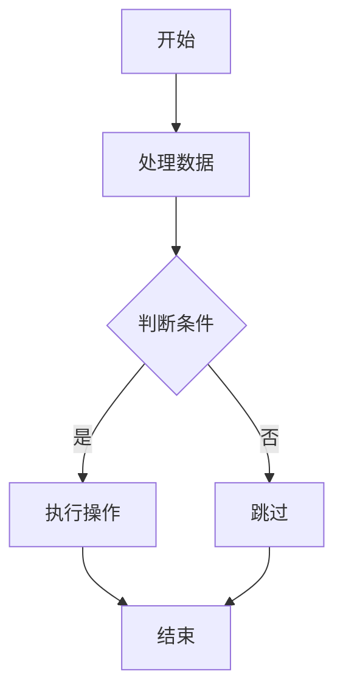
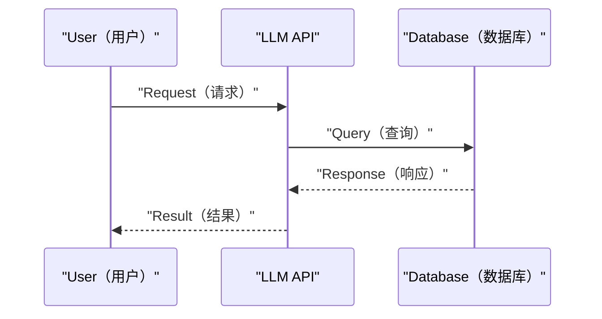
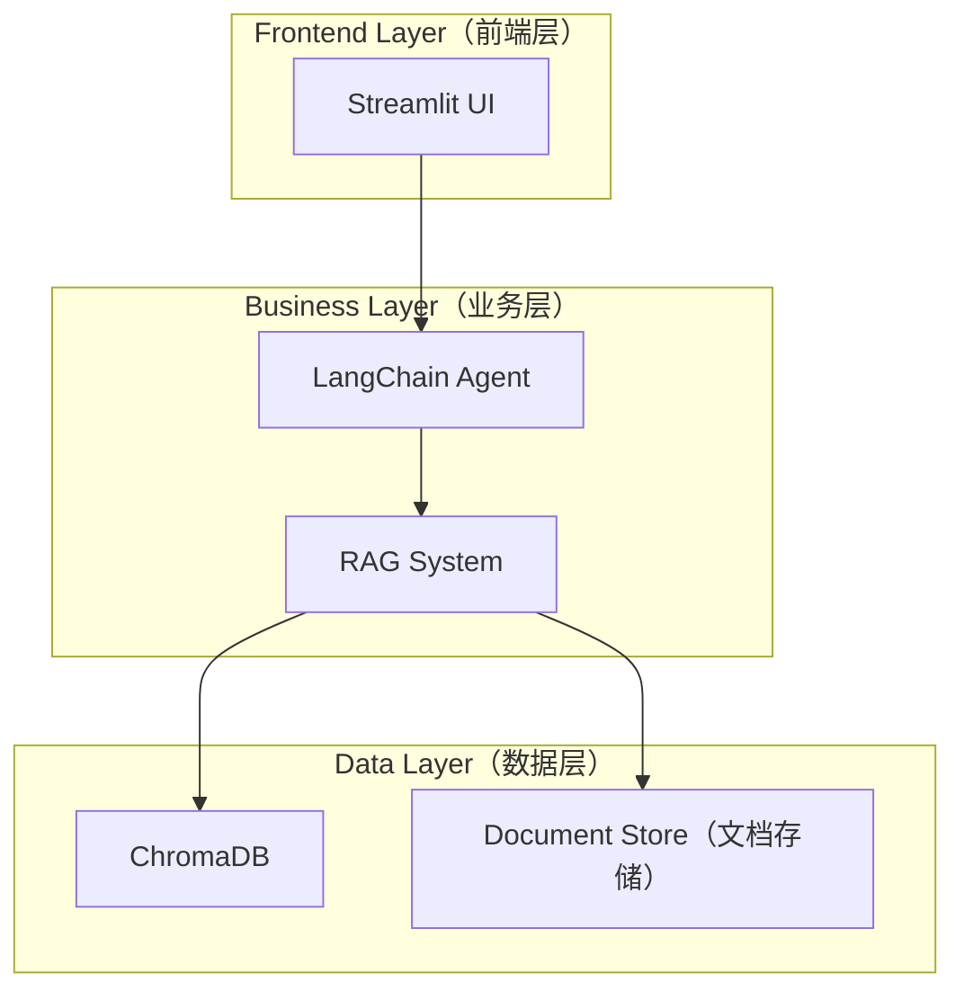
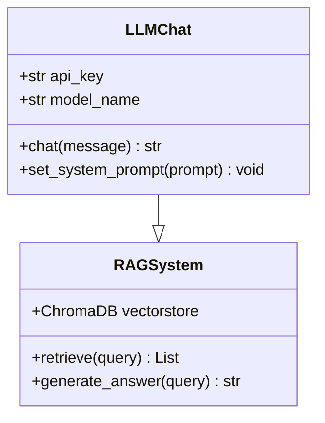
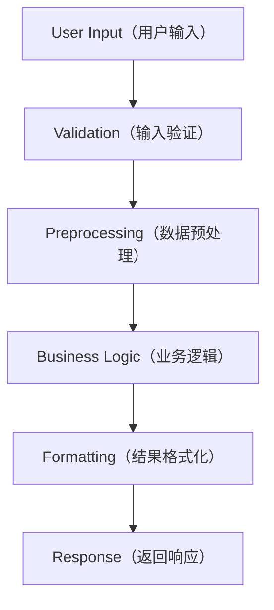
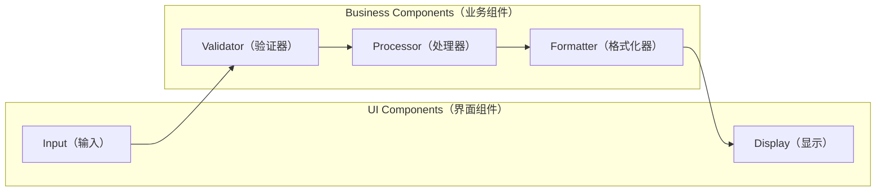
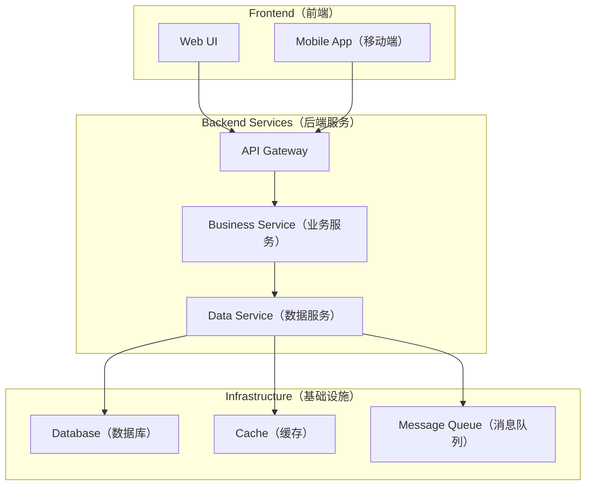
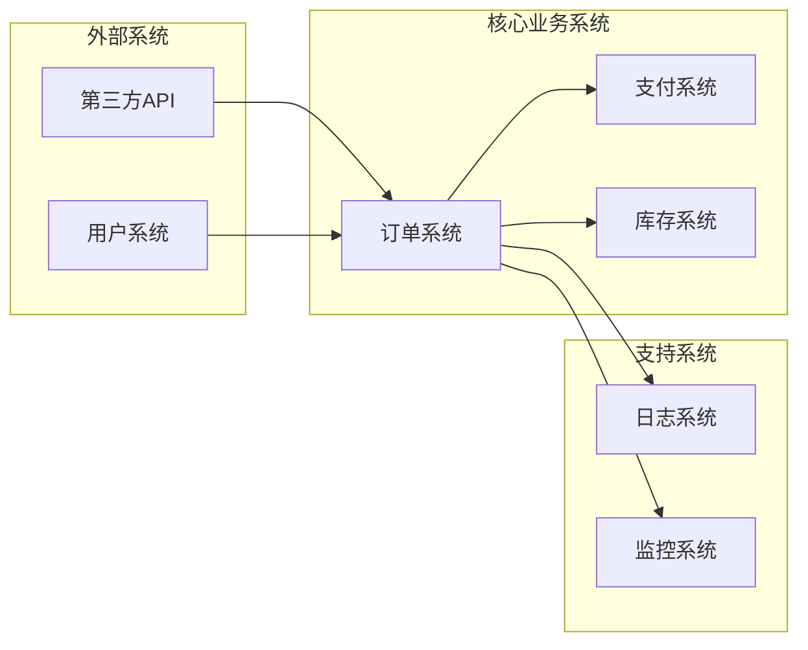

# Mermaid 图表绘制规则

## 🎯 **核心策略：C4 Model（分层架构模型）**

### **分层原则**
- **Level 1**: Code Level（代码级）- 函数、类、方法
- **Level 2**: Component Level（组件级）- 模块、服务  
- **Level 3**: System Level（系统级）- 服务间交互
- **Level 4**: Enterprise Level（企业级）- 系统边界、用户交互

### **绘制流程**
1. **Bottom-up Approach（自底向上）**：从代码级开始
2. **Progressive Abstraction（渐进抽象）**：逐步合并为高层视图
3. **Iterative Refinement（迭代优化）**：重复直到达到所需抽象级别

## 🔧 **基本要求**
- 确保 Mermaid 语法正确，可渲染
- 暗黑主题下清晰可见
- 使用双引号包裹文本标签
- 避免自定义颜色，使用默认主题

## 📊 **图表类型选择**

### **1. Flowchart（流程图）- Logic & Sequence（逻辑序列）**

**适用场景**：

- 算法流程说明
- 业务逻辑展示
- 决策过程描述
- **C4 Level 1**: 函数内部逻辑

### **2. Sequence Diagram（时序图）- Interaction（交互过程）**

**适用场景**：

- API 调用流程
- 系统交互过程
- 数据流向说明
- **C4 Level 2-3**: 组件间交互

### **3. Graph（架构图）- System Structure（系统结构）**

**适用场景**：

- 系统架构设计
- 模块关系展示
- 技术栈说明
- **C4 Level 3**: 系统级架构

### **4. Class Diagram（类图）- Object Structure（对象结构）**

**适用场景**：

- 面向对象设计
- 类关系说明
- 代码结构展示
- **C4 Level 1**: 代码级结构

## 🚀 **C4 Model 图表生成策略**

### **Level 1: Code Level（代码级）**

### **Level 2: Component Level（组件级）**

### **Level 3: System Level（系统级）**

### **Level 4: 企业级图表**

## 📝 **绘制规范**

### **Text（文本）**
- 节点文本使用中文
- 关键术语保留英文并添加中文注释，如：`"User（用户）"`
- 文本简洁明了，避免过长描述

### **Layout（布局）**
- 流程从上到下（TD）或从左到右（LR）
- 合理使用 `subgraph` 分组相关组件
- 保持对齐和美观

### **Arrow（箭头）**
- `-->` 实线箭头：主要流程
- `-.->` 虚线箭头：可选/辅助流程  
- `<-->` 双向箭头：双向交互

## 💡 **最佳实践**

### **Generation Strategy（生成策略）**
1. **Start Small（从小开始）**：选择单个函数/路由/流程
2. **Progressive Build（渐进构建）**：逐步扩展和合并图表
3. **Complexity Control（复杂度控制）**：每图 10-15 个节点以内

### **Prompt Examples（提示词示例）**
- **Flow Control（流程控制）**："显示 Request 如何从 Controller 流向 Database"
- **Data Flow（数据流向）**："追踪这个 Variable 从 Input 到 Output 的完整路径"  
- **Structure Analysis（结构分析）**："给我这个 Service 的 Component Level 视图"

## ⚠️ **注意事项**
- 图表复杂度适中，避免 Information Overload（信息过载）
- 重要节点使用不同 Shape（形状）区分
- 确保图表与 Code Implementation（代码实现）一致
- 遵循 C4 Model 分层原则

## 🔗 **参考资源**
- [Cursor Docs - Architectural Diagrams](https://docs.cursor.com/en/guides/tutorials/architectural-diagrams)
- [C4 Model](https://c4model.com/)  
- [Mermaid Docs](https://mermaid.js.org/)
