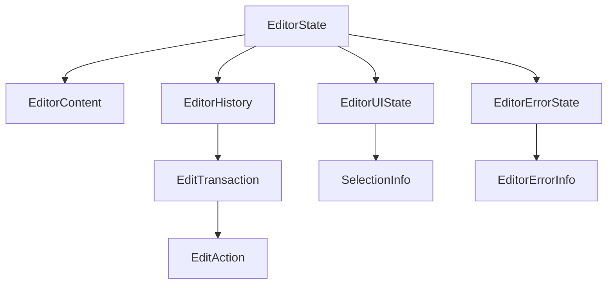
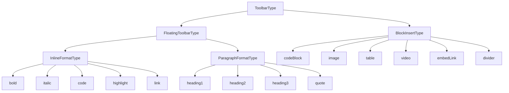

# Markdown 编辑器类型架构设计文档

> 版本：v1.0
> 更新时间：2025-01-24
> 文件位置：`frontend/src/components/editor/types/editor.ts`

## 📋 目录

1. [架构概览](#架构概览)
2. [设计原则](#设计原则)
3. [类型系统分层](#类型系统分层)
4. [核心类型详解](#核心类型详解)
5. [工具栏类型系统](#工具栏类型系统)
6. [配置系统](#配置系统)
7. [类型关系图](#类型关系图)
8. [使用示例](#使用示例)
9. [最佳实践](#最佳实践)

---

## 架构概览

### 整体设计思想

本编辑器的类型系统采用**分层架构**设计，将编辑器状态按照**生命周期**和**职责**进行分离，确保：

- ✅ **关注点分离**：不同类型的状态有明确的边界
- ✅ **可维护性**：每层独立演化，互不影响
- ✅ **可测试性**：每层可以单独测试
- ✅ **类型安全**：利用 TypeScript 高级特性防止错误

### 四层架构模型

```
┌─────────────────────────────────────────────────┐
│  Layer 4: 配置层 (Configuration Layer)         │
│  - EditorConfig, AutoSaveConfig, ToolbarConfig │
│  - 初始化时确定，运行时不变                     │
└─────────────────────────────────────────────────┘
                     ↓
┌─────────────────────────────────────────────────┐
│  Layer 3: 错误层 (Error Layer)                 │
│  - EditorErrorState, EditorErrorInfo           │
│  - 异常情况下临时出现                           │
└─────────────────────────────────────────────────┘
                     ↓
┌─────────────────────────────────────────────────┐
│  Layer 2: UI 状态层 (UI State Layer)           │
│  - SelectionInfo, EditorUIState                │
│  - 频繁变化，不持久化                           │
└─────────────────────────────────────────────────┘
                     ↓
┌─────────────────────────────────────────────────┐
│  Layer 1: 内容层 (Content Layer)               │
│  - EditorContent, EditorHistory                │
│  - 必须持久化，用户核心数据                     │
└─────────────────────────────────────────────────┘
```

---

## 设计原则

### 1. 职责分离（Separation of Concerns）

**问题**：传统的扁平状态设计会导致不同生命周期的数据混在一起。

**解决方案**：按生命周期和用途分层。

```typescript
// ❌ 不好的设计：所有状态混在一起
interface BadEditorState {
  content: string       // 需要持久化
  title: string         // 需要持久化
  cursorPos: number     // 频繁变化，不持久化
  isSaving: boolean     // UI 状态
  lastSaved: Date       // 元信息
}

// ✅ 好的设计：按职责分层
interface EditorContent {
  content: string
  title: string
}

interface EditorUIState {
  selection: SelectionInfo
  isSaving: boolean
}
```

### 2. 数据完整性（Data Integrity）

确保所有必要的元数据都有定义，避免隐式依赖。

```typescript
// ✅ 完整的选区信息
export interface SelectionInfo {
  start: number
  end: number
  selectedText: string  // 显式存储，避免重复计算
  isEmpty: boolean      // 计算属性，提升可读性
}
```

### 3. 类型安全（Type Safety）

利用 TypeScript 的高级特性（Union Types、Discriminated Union）防止类型错误。

```typescript
// ✅ 使用 discriminated union 确保类型安全
export type ToolbarItem = FloatingToolbarItem | BlockToolbarItem

// TypeScript 能自动推断：
if (item.action === 'bold') {
  // 这里 item 的类型自动收窄为 InlineToolbarItem
  item.requiresSelection // ✅ 类型安全，值为 true
}
```

### 4. 扩展性（Extensibility）

支持插件系统、权限控制、国际化等扩展需求。

```typescript
export interface EditorConfig {
  plugins?: EditorPlugin[]
  locale?: EditorLocales
  permissions?: PermissionConfig
}
```

---

## 类型系统分层

### Layer 1: 内容层 - 核心数据

**特点**：
- ✅ 必须持久化到数据库
- ✅ 用户最关心的数据
- ✅ 变化频率：低

#### 1.1 EditorContent - 编辑器内容

```typescript
export interface EditorContent {
  title: string       // 文章标题
  content: string     // 文章正文（Markdown 格式）
}
```

**设计要点**：
- 只包含纯内容，不包含 UI 状态
- 可以直接序列化保存到数据库

#### 1.2 EditorHistory - 编辑历史

**核心概念**：
- **EditAction**：原子操作（底层不可再分）
- **EditTransaction**：事务（用户可感知的一次操作）
- **EditorHistory**：历史管理（撤销/重做栈）

```typescript
// 原子操作
export interface EditAction {
  type: 'insert' | 'delete' | 'format' | 'replace'
  content?: string
  start?: number
  end?: number
  previousContent?: string
  timestamp: number
}

// 事务（多个原子操作的组合）
export interface EditTransaction {
  id: string
  label: string              // 用户可读描述："输入文本"、"应用加粗"
  actions: EditAction[]
  timestamp: number
}

// 历史管理
export interface EditorHistory {
  transactions: EditTransaction[]
  currentIndex: number      // -1 表示初始状态
}
```

**设计灵感**：参考 VS Code、ProseMirror、Google Docs 的 OT (Operational Transformation) 模型。

**示例**：

```typescript
// 用户连续输入 "hello"
// ↓ 产生 5 个 EditAction
[
  { type: 'insert', content: 'h', timestamp: 1000 },
  { type: 'insert', content: 'e', timestamp: 1010 },
  { type: 'insert', content: 'l', timestamp: 1020 },
  { type: 'insert', content: 'l', timestamp: 1030 },
  { type: 'insert', content: 'o', timestamp: 1040 },
]

// ↓ 自动合并成 1 个 EditTransaction（时间窗口内相同类型操作）
{
  id: 'txn-1',
  label: '输入文本',
  actions: [/* 上面 5 个 */],
  timestamp: 1000
}

// ↓ 用户撤销 1 次 Ctrl+Z
// 整个 "hello" 都被删除（而不是只删除 'o'）
```

**撤销/重做逻辑**：

```typescript
// 初始状态
transactions: []
currentIndex: -1  // 未进行任何操作

// 用户输入 "hello"
transactions: [txn1]
currentIndex: 0   // 处于 txn1 之后

// 用户再输入 "world"
transactions: [txn1, txn2]
currentIndex: 1   // 处于 txn2 之后

// 用户撤销（Ctrl+Z）
transactions: [txn1, txn2]
currentIndex: 0   // 回到 txn1 之后，txn2 的效果被移除

// 用户重做（Ctrl+Y）
transactions: [txn1, txn2]
currentIndex: 1   // 重新应用 txn2

// 用户在撤销后进行新操作（输入 "!"）
transactions: [txn1, txn3]  // txn2 被清除
currentIndex: 1
```

---

### Layer 2: UI 状态层 - 实时界面状态

**特点**：
- ❌ 不持久化
- 🔄 频繁变化（光标移动、选中文本）
- 📊 UI 组件直接订阅

#### 2.1 SelectionInfo - 文本选区信息

```typescript
export interface SelectionInfo {
  start: number           // 选中起始位置（字符索引）
  end: number             // 选中结束位置
  selectedText: string    // 选中的文本内容
  isEmpty: boolean        // 是否为空选区（光标）
}
```

**设计要点**：
- `isEmpty` 是计算属性（`start === end`），但显式存储以提升性能
- `selectedText` 可以从 `content.substring(start, end)` 计算，但缓存避免重复计算

#### 2.2 EditorUIState - 完整 UI 状态

```typescript
export interface EditorUIState {
  selection: SelectionInfo
  isSaving: boolean       // 是否正在保存
  isDirty: boolean        // 是否有未保存的改动
  isFocused: boolean      // 编辑器是否获得焦点
}
```

---

### Layer 3: 错误层 - 异常状态

**特点**：
- ⚠️ 临时状态，出现错误时设置
- 🔧 支持错误恢复和重试

#### 3.1 EditorErrorInfo - 错误详情

```typescript
export interface EditorErrorInfo {
  code: string            // 错误代码（如 'SAVE_FAILED'）
  message: string         // 用户可读的错误信息
  originalError?: Error   // 原始错误对象（用于日志）
  timestamp: number       // 错误发生时间
  recoverable: boolean    // 是否可以恢复（比如重试）
}
```

#### 3.2 EditorErrorState - 错误状态管理

```typescript
export interface EditorErrorState {
  hasError: boolean
  error?: EditorErrorInfo
}
```

---

### Layer 4: 完整状态 - 组合所有层

```typescript
export interface EditorState
  extends EditorContent,
          EditorHistory,
          EditorUIState,
          EditorErrorState {

  // 额外元信息
  lastSaved?: Date

  // 计算属性的缓存（避免频繁计算）
  canUndo: boolean    // currentIndex >= 0
  canRedo: boolean    // currentIndex < transactions.length - 1
}
```

**设计要点**：
- 使用 `extends` 组合多个接口（Mixin 模式）
- `canUndo`/`canRedo` 是缓存的计算属性，避免每次都从 `history` 计算

---

## 工具栏类型系统

### 设计目标

1. **类型安全**：不同工具栏项有不同的行为约束
2. **可扩展**：易于添加新的操作类型
3. **自文档化**：类型定义即文档

### 操作类型分类

```typescript
/**
 * 操作类型体系
 *
 * ToolbarType (所有操作)
 *   ├── FloatingToolbarType (浮动工具栏)
 *   │     ├── InlineFormatType (行内格式)
 *   │     │     ├── bold, italic, code
 *   │     │     ├── highlight, link
 *   │     │     └── 特点：需要选中文本
 *   │     └── ParagraphFormatType (段落格式)
 *   │           ├── heading1, heading2, heading3
 *   │           ├── quote
 *   │           └── 特点：作用于整个段落
 *   └── BlockInsertType (块级插入)
 *         ├── codeBlock, image, table
 *         ├── video, embedLink, divider
 *         └── 特点：插入新内容
 */
```

### 具体类型定义

#### 1. InlineFormatType - 行内格式

```typescript
export type InlineFormatType =
  | 'bold'       // **文字**
  | 'italic'     // *文字*
  | 'code'       // `文字`
  | 'highlight'  // ==文字==
  | 'link'       // [文字](url)
```

**特点**：
- ✅ 需要用户选中文本才能应用
- ✅ 前后包裹语法
- ✅ 支持 Toggle（已格式化可移除）

#### 2. ParagraphFormatType - 段落格式

```typescript
export type ParagraphFormatType =
  | 'heading1'   // # 文字
  | 'heading2'   // ## 文字
  | 'heading3'   // ### 文字
  | 'quote'      // > 文字
```

**特点**：
- ✅ 作用于整个段落（不需要选中全文）
- ✅ 行首前缀语法
- ✅ 光标在任何位置都可以应用

#### 3. BlockInsertType - 块级插入

```typescript
export type BlockInsertType =
  | 'codeBlock'   // ```language\n...code...\n```
  | 'image'       // 
  | 'table'       // | col1 | col2 |
  | 'video'       // 嵌入视频
  | 'embedLink'   // 嵌入外链预览
  | 'divider'     // ---
```

**特点**：
- ✅ 插入新的块级内容
- ✅ 独占一行或多行
- ✅ 可能需要额外输入（如图片 URL）

### 工具栏项类型

使用 **Discriminated Union** 确保类型安全：

```typescript
// 行内格式工具栏项
interface InlineToolbarItem extends ToolbarItemBase {
  action: InlineFormatType
  requiresSelection: true   // ✅ 强制要求选中文本
}

// 段落格式工具栏项
interface ParagraphToolbarItem extends ToolbarItemBase {
  action: ParagraphFormatType
  requiresSelection: false  // ✅ 不需要选中文本
}

// 浮动工具栏项（Union Type）
export type FloatingToolbarItem = InlineToolbarItem | ParagraphToolbarItem

// 块级插入工具栏项
export interface BlockToolbarItem extends ToolbarItemBase {
  action: BlockInsertType
}

// 所有工具栏项
export type ToolbarItem = FloatingToolbarItem | BlockToolbarItem
```

**类型安全示例**：

```typescript
function handleToolbarClick(item: ToolbarItem) {
  // TypeScript 能自动推断类型
  if (item.action === 'bold') {
    // 这里 item 的类型自动收窄为 InlineToolbarItem
    console.log(item.requiresSelection) // ✅ true
  }

  if (item.action === 'heading1') {
    // 这里 item 的类型自动收窄为 ParagraphToolbarItem
    console.log(item.requiresSelection) // ✅ false
  }
}
```

---

## 配置系统

### AutoSaveConfig - 自动保存配置

**设计思路**：采用**分层保存策略**

```typescript
export interface AutoSaveConfig {
  enabled: boolean

  // 本地保存（快速、同步）
  localStorageInterval?: number  // 默认 2000ms
  draftKey?: string              // 默认 'editor-draft'

  // 服务器保存（可靠、异步）
  apiUrl?: string
  apiInterval?: number           // 默认 10000ms

  // 重试配置
  maxRetries?: number
  retryDelay?: number

  // 保存策略
  storage: 'localStorage' | 'api' | 'both'  // 推荐 'both'

  // 页面卸载处理
  saveOnBeforeUnload?: boolean
}
```

**推荐配置**：

```typescript
{
  enabled: true,
  storage: 'both',
  localStorageInterval: 2000,    // 2秒保存到本地
  apiInterval: 10000,            // 10秒保存到服务器
  maxRetries: 3,
  saveOnBeforeUnload: true
}
```

**工作原理**：

```
用户输入
   ↓
每 2 秒 → localStorage（同步、快速）
   ↓
每 10 秒 → API（异步、可靠）
   ↓
关闭页面前 → 强制保存一次
```

### EditorConfig - 完整配置

```typescript
export interface EditorConfig {
  // 基础配置
  title?: string
  content?: string
  placeholder?: string

  // 功能开关
  readOnly?: boolean
  spellCheck?: boolean

  // 工具栏配置
  toolbars?: {
    floating?: ToolbarConfig
    blockMenu?: ToolbarConfig
  }

  // 自动保存
  autoSave?: AutoSaveConfig

  // 撤销重做
  historySize?: number           // 默认 50

  // 插件系统
  plugins?: EditorPlugin[]

  // 国际化
  locale?: EditorLocales

  // 权限控制
  permissions?: PermissionConfig

  // 样式配置
  toolbarStyle?: ToolbarStyleConfig

  // 错误处理
  errorHandling?: ErrorHandlerConfig

  // 事件回调
  callbacks?: {
    onContentChange?: (content: string) => void
    onSave?: (state: EditorState) => void
    onError?: (error: EditorErrorInfo) => void
  }
}
```

### editor.config.ts - 默认配置文件

**设计目的**：将类型定义与默认值分离，提供开箱即用的配置。

#### 设计模式：类型与值分离

```
┌─────────────────────────────────────────────┐
│  类型定义 (editor.ts)                       │
│  - 定义"可以配置什么"                       │
│  - TypeScript 接口                          │
│  - 编译时类型检查                           │
└────────────┬────────────────────────────────┘
             ↓
┌─────────────────────────────────────────────┐
│  默认配置 (editor.config.ts)                │
│  - 定义"默认是什么"                         │
│  - 运行时实例                               │
│  - 开箱即用的值                             │
└────────────┬────────────────────────────────┘
             ↓
┌─────────────────────────────────────────────┐
│  用户使用                                    │
│  - 部分覆盖默认值                           │
│  - 深度合并配置                             │
└─────────────────────────────────────────────┘
```

#### 文件内容示例

```typescript
// src/components/editor/types/editor.config.ts
import type { EditorConfig, FloatingToolbarItem } from './editor'

/**
 * 默认浮动工具栏配置
 */
const defaultFloatingToolbarItems: FloatingToolbarItem[] = [
  // 行内格式
  {
    id: 'bold',
    action: 'bold',
    icon: 'Bold',
    title: '加粗 (Ctrl+B)',
    hotkey: 'Ctrl+B',
    requiresSelection: true,
  },
  {
    id: 'italic',
    action: 'italic',
    icon: 'Italic',
    title: '斜体 (Ctrl+I)',
    hotkey: 'Ctrl+I',
    requiresSelection: true,
  },
  {
    id: 'code',
    action: 'code',
    icon: 'Code',
    title: '行内代码',
    requiresSelection: true,
  },
  {
    id: 'highlight',
    action: 'highlight',
    icon: 'Highlighter',
    title: '高亮',
    requiresSelection: true,
  },
  {
    id: 'link',
    action: 'link',
    icon: 'Link',
    title: '链接',
    requiresSelection: true,
  },

  // 段落格式
  {
    id: 'heading1',
    action: 'heading1',
    icon: 'Heading1',
    title: '一级标题',
    requiresSelection: false,
  },
  {
    id: 'heading2',
    action: 'heading2',
    icon: 'Heading2',
    title: '二级标题',
    requiresSelection: false,
  },
  {
    id: 'heading3',
    action: 'heading3',
    icon: 'Heading3',
    title: '三级标题',
    requiresSelection: false,
  },
  {
    id: 'quote',
    action: 'quote',
    icon: 'Quote',
    title: '引用',
    requiresSelection: false,
  },
]

/**
 * 默认编辑器配置
 *
 * 这个配置可以满足 80% 的使用场景，用户可以根据需要覆盖任何配置项。
 */
export const defaultEditorConfig: EditorConfig = {
  // 基础配置
  placeholder: '开始编写你的内容...',
  readOnly: false,
  spellCheck: true,

  // 工具栏配置
  toolbars: {
    floating: {
      position: 'floating',
      items: defaultFloatingToolbarItems,
    },
  },

  // 自动保存配置（推荐：本地 + 服务器双保险）
  autoSave: {
    enabled: true,
    storage: 'both',
    localStorageInterval: 2000,    // 2秒保存到本地
    apiInterval: 10000,            // 10秒保存到服务器
    maxRetries: 3,
    retryDelay: 1000,
    draftKey: 'editor-draft',
    saveOnBeforeUnload: true,
  },

  // 历史管理
  historySize: 50,  // 最多保留 50 个操作

  // 国际化（默认中文）
  locale: {
    bold: '加粗',
    italic: '斜体',
    code: '代码',
    highlight: '高亮',
    link: '链接',
    heading1: '一级标题',
    heading2: '二级标题',
    heading3: '三级标题',
    quote: '引用',
    codeBlock: '代码块',
    image: '图片',
    table: '表格',
    selectTextToFormat: '请先选中文本',
    savingDraft: '正在保存草稿...',
    saveSuccess: '保存成功',
    saveFailed: '保存失败',
  },

  // 权限控制
  permissions: {
    canEdit: true,
    canUndo: true,
    canRedo: true,
  },

  // 事件回调（用户可以覆盖）
  callbacks: {
    onContentChange: undefined,
    onSave: undefined,
    onError: undefined,
  },
}
```

#### 使用方式

**方式 1：完全使用默认配置**

```typescript
import { useMarkdownEditor } from './composables/useMarkdownEditor'

// 使用所有默认配置
const editor = useMarkdownEditor()
```

**方式 2：部分覆盖配置**

```typescript
import { useMarkdownEditor } from './composables/useMarkdownEditor'
import { defaultEditorConfig } from './types/editor.config'

// 只修改需要的部分
const editor = useMarkdownEditor({
  ...defaultEditorConfig,
  placeholder: '写点什么吧...',  // 自定义占位符
  autoSave: {
    ...defaultEditorConfig.autoSave,
    enabled: false,  // 关闭自动保存
  },
  callbacks: {
    onContentChange: (content) => {
      console.log('内容变化:', content)
    },
  },
})
```

**方式 3：深度合并配置（工具函数）**

```typescript
// utils/configMerge.ts
import type { EditorConfig } from '../types/editor'
import { defaultEditorConfig } from '../types/editor.config'

/**
 * 深度合并配置
 *
 * @param userConfig - 用户提供的配置
 * @returns 合并后的完整配置
 */
export function mergeEditorConfig(
  userConfig: Partial<EditorConfig> = {}
): EditorConfig {
  return {
    ...defaultEditorConfig,
    ...userConfig,
    autoSave: {
      ...defaultEditorConfig.autoSave,
      ...userConfig.autoSave,
    },
    toolbars: {
      floating: userConfig.toolbars?.floating || defaultEditorConfig.toolbars?.floating,
      blockMenu: userConfig.toolbars?.blockMenu || defaultEditorConfig.toolbars?.blockMenu,
    },
    permissions: {
      ...defaultEditorConfig.permissions,
      ...userConfig.permissions,
    },
    callbacks: {
      ...defaultEditorConfig.callbacks,
      ...userConfig.callbacks,
    },
  }
}

// 使用
const editor = useMarkdownEditor(
  mergeEditorConfig({
    title: '我的文章',
    autoSave: { enabled: false },
  })
)
```

#### 设计优势

| 优势        | 说明                    |
| --------- | --------------------- |
| **开箱即用**  | 用户不传配置也能正常工作（80%场景）   |
| **灵活定制**  | 用户可以覆盖任何配置项（20%场景）    |
| **集中管理**  | 全局默认值统一维护，便于调整        |
| **类型安全**  | TypeScript 编译时检查配置完整性 |
| **文档即代码** | 默认配置本身就是最好的示例         |

#### 配置验证

**推荐**：在 `useMarkdownEditor` 中验证配置的完整性

```typescript
// composables/useMarkdownEditor.ts
import { defaultEditorConfig } from '../types/editor.config'
import type { EditorConfig } from '../types/editor'

export function useMarkdownEditor(
  userConfig: Partial<EditorConfig> = {}
) {
  // 1. 合并配置
  const config = mergeEditorConfig(userConfig)

  // 2. 验证配置
  validateConfig(config)

  // 3. 初始化编辑器
  // ...
}

function validateConfig(config: EditorConfig): void {
  // 验证自动保存配置
  if (config.autoSave?.enabled && config.autoSave.storage === 'api') {
    if (!config.autoSave.apiUrl) {
      throw new Error(
        '启用 API 自动保存时必须提供 apiUrl 配置'
      )
    }
  }

  // 验证历史大小
  if (config.historySize && config.historySize < 1) {
    throw new Error('historySize 必须大于 0')
  }

  // 验证工具栏配置
  if (config.toolbars?.floating) {
    if (config.toolbars.floating.items.length === 0) {
      console.warn('浮动工具栏没有配置任何按钮')
    }
  }
}
```

#### 常见配置场景

**场景 1：评论编辑器（简化版）**

```typescript
const commentEditorConfig: Partial<EditorConfig> = {
  placeholder: '写下你的评论...',
  autoSave: { enabled: false },  // 评论不需要自动保存
  toolbars: {
    floating: {
      position: 'floating',
      items: [
        // 只保留基础格式
        { id: 'bold', action: 'bold', requiresSelection: true },
        { id: 'italic', action: 'italic', requiresSelection: true },
        { id: 'link', action: 'link', requiresSelection: true },
      ],
    },
  },
  historySize: 10,  // 评论历史不需要太多
}
```

**场景 2：只读预览模式**

```typescript
const previewConfig: Partial<EditorConfig> = {
  readOnly: true,
  permissions: {
    canEdit: false,
    canUndo: false,
    canRedo: false,
  },
  autoSave: { enabled: false },
}
```

**场景 3：企业内网（无服务器自动保存）**

```typescript
const intranetConfig: Partial<EditorConfig> = {
  autoSave: {
    enabled: true,
    storage: 'localStorage',  // 只用本地存储
    localStorageInterval: 1000,  // 1秒保存
  },
}
```

#### 参考资料

这种"类型与值分离"的设计模式在业界广泛使用：

- **Vue Router**: `RouteRecordRaw` (类型) + `createRouter()` (实例)
- **Vite**: `UserConfig` (类型) + `defineConfig()` (配置)
- **ESLint**: `.eslintrc` (类型) + 默认规则
- **Prettier**: `Options` (类型) + `.prettierrc` (默认值)

---

## 类型关系图

### 状态组合关系



### 操作类型继承关系



---

## 使用示例

### 示例 1：初始化编辑器

```typescript
import type { EditorState, EditorConfig } from './types/editor'

const config: EditorConfig = {
  title: '我的文章',
  content: '# 标题\n\n这是内容',
  autoSave: {
    enabled: true,
    storage: 'both',
    localStorageInterval: 2000,
    apiUrl: '/api/articles/auto-save',
    apiInterval: 10000,
  },
  callbacks: {
    onContentChange: (content) => {
      console.log('内容变化:', content)
    },
  },
}

const initialState: EditorState = {
  // 内容层
  title: config.title || '',
  content: config.content || '',

  // 历史层
  transactions: [],
  currentIndex: -1,

  // UI 层
  selection: { start: 0, end: 0, selectedText: '', isEmpty: true },
  isSaving: false,
  isDirty: false,
  isFocused: false,

  // 错误层
  hasError: false,

  // 计算属性
  canUndo: false,
  canRedo: false,
}
```

### 示例 2：处理工具栏点击

```typescript
import type { ToolbarItem, InlineFormatType } from './types/editor'

function handleToolbarClick(item: ToolbarItem, selection: SelectionInfo) {
  // TypeScript 自动类型收窄
  if (item.action === 'bold') {
    // item 类型: InlineToolbarItem
    if (!selection.isEmpty) {
      applyInlineFormat('bold', selection)
    } else {
      showWarning('请先选中文本')
    }
  }

  if (item.action === 'heading1') {
    // item 类型: ParagraphToolbarItem
    applyParagraphFormat('heading1')  // 不需要选中文本
  }

  if (item.action === 'codeBlock') {
    // item 类型: BlockToolbarItem
    insertBlock('codeBlock')
  }
}
```

### 示例 3：撤销/重做逻辑

```typescript
import type { EditorHistory, EditTransaction } from './types/editor'

function undo(history: EditorHistory): EditorHistory {
  if (history.currentIndex < 0) {
    return history  // 无法撤销
  }

  // 获取要撤销的事务
  const transaction = history.transactions[history.currentIndex]

  // 反向应用事务中的所有操作
  for (const action of transaction.actions.reverse()) {
    revertAction(action)
  }

  // 移动指针
  return {
    ...history,
    currentIndex: history.currentIndex - 1,
  }
}

function redo(history: EditorHistory): EditorHistory {
  if (history.currentIndex >= history.transactions.length - 1) {
    return history  // 无法重做
  }

  // 获取要重做的事务
  const transaction = history.transactions[history.currentIndex + 1]

  // 重新应用事务中的所有操作
  for (const action of transaction.actions) {
    applyAction(action)
  }

  // 移动指针
  return {
    ...history,
    currentIndex: history.currentIndex + 1,
  }
}
```

### 示例 4：自动合并编辑操作

```typescript
import type { EditTransaction, EditAction } from './types/editor'

const MERGE_WINDOW_MS = 500  // 500ms 内的相同操作自动合并

function addTransaction(
  history: EditorHistory,
  newTransaction: EditTransaction
): EditorHistory {
  const lastTxn = history.transactions[history.currentIndex]

  // 判断是否可以合并
  const canMerge =
    lastTxn &&
    newTransaction.timestamp - lastTxn.timestamp < MERGE_WINDOW_MS &&
    newTransaction.label === lastTxn.label  // 相同类型的操作

  if (canMerge) {
    // 合并到最后一个事务
    const mergedTxn: EditTransaction = {
      ...lastTxn,
      actions: [...lastTxn.actions, ...newTransaction.actions],
    }

    const newTransactions = [...history.transactions]
    newTransactions[history.currentIndex] = mergedTxn

    return {
      ...history,
      transactions: newTransactions,
    }
  } else {
    // 添加新事务（清除 currentIndex 之后的历史）
    const newTransactions = [
      ...history.transactions.slice(0, history.currentIndex + 1),
      newTransaction,
    ]

    return {
      ...history,
      transactions: newTransactions,
      currentIndex: newTransactions.length - 1,
    }
  }
}
```

---

## 最佳实践

### 1. 状态更新原则

**✅ 推荐**：使用不可变更新

```typescript
// 好的做法
const newState: EditorState = {
  ...state,
  content: newContent,
  isDirty: true,
}

// 避免
state.content = newContent  // ❌ 可变更新
```

### 2. 计算属性缓存

**✅ 推荐**：在 `EditorState` 中缓存频繁计算的属性

```typescript
export interface EditorState {
  // ...
  canUndo: boolean  // ✅ 缓存，避免每次都从 history 计算
  canRedo: boolean
}

// 计算逻辑
function updateComputedProps(state: EditorState): EditorState {
  return {
    ...state,
    canUndo: state.currentIndex >= 0,
    canRedo: state.currentIndex < state.transactions.length - 1,
  }
}
```

### 3. 类型守卫

**✅ 推荐**：使用类型守卫函数

```typescript
function isInlineFormat(action: ToolbarType): action is InlineFormatType {
  return ['bold', 'italic', 'code', 'highlight', 'link'].includes(action)
}

function isParagraphFormat(action: ToolbarType): action is ParagraphFormatType {
  return ['heading1', 'heading2', 'heading3', 'quote'].includes(action)
}

// 使用
if (isInlineFormat(action)) {
  // TypeScript 知道 action 是 InlineFormatType
  applyInlineFormat(action)
}
```

### 4. 错误处理

**✅ 推荐**：使用 `EditorErrorInfo` 统一错误格式

```typescript
function createError(
  code: string,
  message: string,
  originalError?: Error,
  recoverable: boolean = true
): EditorErrorInfo {
  return {
    code,
    message,
    originalError,
    timestamp: Date.now(),
    recoverable,
  }
}

// 使用
try {
  await saveToServer(content)
} catch (error) {
  const editorError = createError(
    'SAVE_FAILED',
    '保存失败，请检查网络连接',
    error as Error,
    true  // 可恢复
  )

  setState({
    ...state,
    hasError: true,
    error: editorError,
  })
}
```

### 5. 配置验证

**✅ 推荐**：验证配置的完整性

```typescript
function validateConfig(config: Partial<EditorConfig>): EditorConfig {
  // 验证自动保存配置
  if (config.autoSave?.enabled && config.autoSave.storage === 'api') {
    if (!config.autoSave.apiUrl) {
      throw new Error('启用 API 自动保存时必须提供 apiUrl')
    }
  }

  // 设置默认值
  return {
    readOnly: false,
    spellCheck: true,
    historySize: 50,
    ...config,
  }
}
```

---

## 总结

### 核心优势

1. **类型安全**：TypeScript 编译时检查，减少运行时错误
2. **可维护**：分层清晰，每层独立演化
3. **可扩展**：插件系统、权限控制、国际化
4. **高性能**：计算属性缓存，避免重复计算

### 参考资料

- [ProseMirror 架构](https://prosemirror.net/docs/guide/)
- [VS Code 编辑器架构](https://code.visualstudio.com/api/extension-guides/overview)
- [Google Docs OT 论文](https://www.codecommit.com/blog/java/understanding-and-applying-operational-transformation)
- [TypeScript Discriminated Union](https://www.typescriptlang.org/docs/handbook/2/narrowing.html#discriminated-unions)

---

**文档维护者**：项目团队
**最后更新**：2025-01-24
