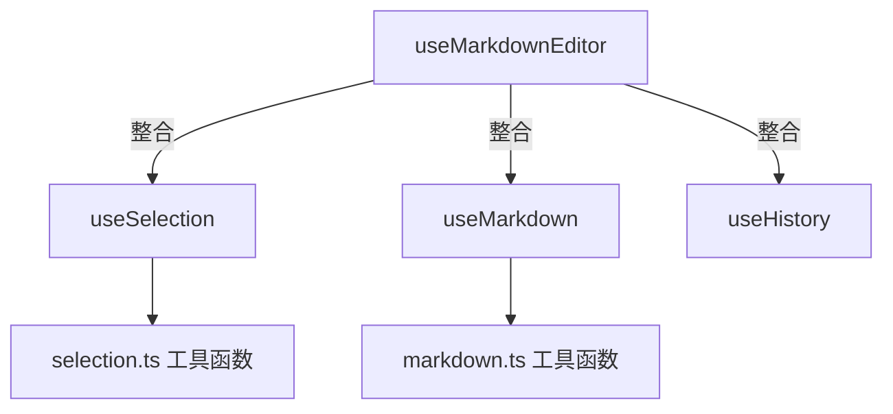

# useMarkdownEditor API 设计文档

> 版本：v1.0  
> 日期：2025-12-01  
> 状态：设计阶段

## 📋 目录

- [设计理念](#设计理念)
- [整体架构](#整体架构)
- [API 接口](#api-接口)
- [使用示例](#使用示例)
- [最佳实践](#最佳实践)

---

## 设计理念

### 核心原则

1. **简洁易用**：一个 composable 提供所有编辑器功能
2. **职责清晰**：整合层不实现具体逻辑，只负责组装和暴露 API
3. **向后兼容**：底层 composables 保持独立，可单独使用
4. **类型安全**：完整的 TypeScript 类型定义

### 设计目标

```typescript
// ❌ 改进前：分散的 API
const selectionAPI = useSelection(editorRef)
const markdownAPI = useMarkdown(editorRef, editorState, selectionAPI)
const historyAPI = useHistory()

// ✅ 改进后：统一的 API
const editor = useMarkdownEditor(editorRef)
editor.bold()
editor.undo()
editor.getContent()
```

---

## 整体架构

### 分层结构



### 文件组织

```
composables/
├── useMarkdownEditor.ts  ← 整合层（对外暴露）
├── useSelection.ts        ← 底层实现
├── useMarkdown.ts         ← 底层实现
└── useHistory.ts          ← 底层实现
```

---

## API 接口

### 1. 内容管理 API

#### getContent()

获取编辑器内容（HTML 格式）

```typescript
getContent(): string
```

**返回值**：编辑器的 HTML 内容

**示例**：

```typescript
const content = editor.getContent()
console.log(content) // "<div>Hello <strong>World</strong></div>"
```

---

#### setContent(content)

设置编辑器内容

```typescript
setContent(content: string): void
```

**参数**：

- `content` - HTML 字符串

**示例**：

```typescript
editor.setContent('<div>新内容</div>')
```

**注意**：

- 会触发历史记录
- 会自动规范化 DOM 结构

---

#### clear()

清空编辑器内容

```typescript
clear(): void
```

**示例**：

```typescript
editor.clear()
```

**等价于**：

```typescript
editor.setContent('<div><br /></div>')
```

---

#### isEmpty()

检查编辑器是否为空

```typescript
isEmpty(): boolean
```

**返回值**：`true` 表示内容为空（只有空 div 或 br）

**示例**：

```typescript
if (editor.isEmpty()) {
  console.log('请输入内容')
}
```

---

### 2. 格式化 API

#### 2.1 行内格式

所有行内格式方法签名：

```typescript
bold(): void        // 加粗
italic(): void      // 斜体
code(): void        // 行内代码
highlight(): void   // 高亮
link(): void        // 链接
```

**行为**：

- 有选中文本：对选中文本应用格式
- 无选中文本：在光标位置应用格式（等待输入）

**示例**：

```typescript
// 用户选中 "hello"
editor.bold()
// 结果：<strong>hello</strong>

// 无选中
editor.bold()
// 输入 "world"
// 结果：<strong>world</strong>
```

---

#### 2.2 段落格式

所有段落格式方法签名：

```typescript
heading1(): void    // 一级标题
heading2(): void    // 二级标题
heading3(): void    // 三级标题
quote(): void       // 引用块
```

**行为**：

- 将当前行（或选中的行）转换为指定格式
- 自动处理多行选择

**示例**：

```typescript
// 光标在 "标题" 这一行
editor.heading1()
// 结果：<h1>标题</h1>
```

---

#### 2.3 块级插入

所有块级插入方法签名：

```typescript
insertDivider(): void      // 插入分割线
insertCodeBlock(): void    // 插入代码块
insertImage(): void        // 插入图片
insertTable(): void        // 插入表格
```

**行为**：

- 在光标位置或选区后插入新块
- 自动换行

**示例**：

```typescript
editor.insertDivider()
// 插入：<hr />
```

---

### 3. 历史管理 API

#### undo()

撤销上一步操作

```typescript
undo(): boolean
```

**返回值**：`true` 表示撤销成功，`false` 表示已到达历史起点

**示例**：

```typescript
if (editor.undo()) {
  console.log('撤销成功')
}
```

**快捷键**：`Ctrl+Z` / `Cmd+Z`

---

#### redo()

重做下一步操作

```typescript
redo(): boolean
```

**返回值**：`true` 表示重做成功，`false` 表示已到达最新状态

**示例**：

```typescript
if (editor.redo()) {
  console.log('重做成功')
}
```

**快捷键**：`Ctrl+Shift+Z` / `Cmd+Shift+Z`

---

#### canUndo

是否可以撤销

```typescript
canUndo: ComputedRef<boolean>
```

**用途**：控制撤销按钮的禁用状态

**示例**：

```vue
<button :disabled="!editor.canUndo" @click="editor.undo()">
  撤销
</button>
```

---

#### canRedo

是否可以重做

```typescript
canRedo: ComputedRef<boolean>
```

**用途**：控制重做按钮的禁用状态

**示例**：

```vue
<button :disabled="!editor.canRedo" @click="editor.redo()">
  重做
</button>
```

---

#### clearHistory()

清空历史记录

```typescript
clearHistory(): void
```

**示例**：

```typescript
editor.clearHistory()
```

**使用场景**：

- 用户明确保存后，清空历史
- 重新加载内容时，重置历史

---

### 4. 选区管理 API

#### focus()

聚焦到编辑器

```typescript
focus(): void
```

**示例**：

```typescript
editor.focus()
```

---

#### blur()

失去焦点

```typescript
blur(): void
```

**示例**：

```typescript
editor.blur()
```

---

#### setCursor(position)

设置光标位置

```typescript
setCursor(position: number): void
```

**参数**：

- `position` - 光标位置（基于纯文本偏移）

**示例**：

```typescript
editor.setCursor(10) // 光标移到第10个字符
```

---

#### selectRange(start, end)

选中指定范围

```typescript
selectRange(start: number, end: number): void
```

**参数**：

- `start` - 起始位置
- `end` - 结束位置

**示例**：

```typescript
editor.selectRange(0, 5) // 选中前5个字符
```

---

#### getSelectionInfo()

获取当前选区信息

```typescript
getSelectionInfo(): SelectionInfo

interface SelectionInfo {
  start: number          // 起始位置
  end: number            // 结束位置
  selectedText: string   // 选中的文本
  isEmpty: boolean       // 是否为空选区
}
```

**示例**：

```typescript
const selection = editor.getSelectionInfo()
if (!selection.isEmpty) {
  console.log('选中了:', selection.selectedText)
}
```

---

### 5. 工具方法 API

#### getTextContent()

获取纯文本内容（无 HTML 标签）

```typescript
getTextContent(): string
```

**示例**：

```typescript
const text = editor.getTextContent()
console.log(text) // "Hello World"（无标签）
```

---

#### getWordCount()

获取字数统计

```typescript
getWordCount(): number
```

**返回值**：字符数（不含空格）

**示例**：

```typescript
const count = editor.getWordCount()
console.log(`字数：${count}`)
```

---

#### isDirty()

检查内容是否已修改（相对于初始或上次保存）

```typescript
isDirty(): boolean
```

**返回值**：`true` 表示有未保存的修改

**示例**：

```typescript
if (editor.isDirty()) {
  console.log('有未保存的修改')
}
```

---

#### markClean()

标记内容为"干净"（已保存）

```typescript
markClean(): void
```

**示例**：

```typescript
await saveContent(editor.getContent())
editor.markClean()
```

---

### 6. 生命周期 API

#### destroy()

销毁编辑器实例

```typescript
destroy(): void
```

**行为**：

- 清理事件监听器
- 清理定时器
- 释放资源

**示例**：

```typescript
onUnmounted(() => {
  editor.destroy()
})
```

---

## 使用示例

### 基础使用

```vue
<script setup>
import { ref } from 'vue'
import { useMarkdownEditor } from '@/composables/useMarkdownEditor'

const editorRef = (ref < HTMLElement) | (null > null)
const editor = useMarkdownEditor(editorRef)

// 格式化
const handleBold = () => editor.bold()

// 获取内容
const handleSave = () => {
  const content = editor.getContent()
  console.log(content)
}

// 清空
const handleClear = () => editor.clear()
</script>

<template>
  <div>
    <button @click="handleBold">加粗</button>
    <button @click="handleSave">保存</button>
    <button @click="handleClear">清空</button>

    <div ref="editorRef" contenteditable="true"></div>
  </div>
</template>
```

---

### 工具栏集成

```vue
<script setup>
const editor = useMarkdownEditor(editorRef)

const toolbar = [
  { icon: 'Bold', action: () => editor.bold() },
  { icon: 'Italic', action: () => editor.italic() },
  { icon: 'Code', action: () => editor.code() },
  { icon: 'Undo', action: () => editor.undo(), disabled: () => !editor.canUndo.value },
  { icon: 'Redo', action: () => editor.redo(), disabled: () => !editor.canRedo.value },
]
</script>
```

---

### 表单集成

```vue
<script setup>
import { useMarkdownEditor } from '@/composables/useMarkdownEditor'
import { ref, watch } from 'vue'

const editorRef = ref<HTMLElement | null>(null)
const editor = useMarkdownEditor(editorRef)

// v-model 支持
const modelValue = defineModel<string>()

// 双向绑定
watch(() => editor.getContent(), (newContent) => {
  modelValue.value = newContent
})

watch(modelValue, (newValue) => {
  if (newValue !== editor.getContent()) {
    editor.setContent(newValue || '')
  }
})
</script>
```

---

### 自动保存

```vue
<script setup>
import { useMarkdownEditor } from '@/composables/useMarkdownEditor'
import { watchDebounced } from '@vueuse/core'

const editor = useMarkdownEditor(editorRef)

// 自动保存（2秒防抖）
watchDebounced(
  () => editor.getContent(),
  async (content) => {
    if (editor.isDirty()) {
      await saveToServer(content)
      editor.markClean()
      console.log('自动保存成功')
    }
  },
  { debounce: 2000 },
)
</script>
```

---

## 类型定义

```typescript
// composables/useMarkdownEditor.ts
export interface MarkdownEditorAPI {
  // 内容管理
  getContent: () => string
  setContent: (content: string) => void
  clear: () => void
  isEmpty: () => boolean

  // 格式化 - 行内
  bold: () => void
  italic: () => void
  code: () => void
  highlight: () => void
  link: () => void

  // 格式化 - 段落
  heading1: () => void
  heading2: () => void
  heading3: () => void
  quote: () => void

  // 格式化 - 块级
  insertDivider: () => void
  insertCodeBlock: () => void
  insertImage: () => void
  insertTable: () => void

  // 历史管理
  undo: () => boolean
  redo: () => boolean
  canUndo: ComputedRef<boolean>
  canRedo: ComputedRef<boolean>
  clearHistory: () => void

  // 选区管理
  focus: () => void
  blur: () => void
  setCursor: (position: number) => void
  selectRange: (start: number, end: number) => void
  getSelectionInfo: () => SelectionInfo

  // 工具方法
  getTextContent: () => string
  getWordCount: () => number
  isDirty: () => boolean
  markClean: () => void

  // 生命周期
  destroy: () => void
}

export function useMarkdownEditor(editorElement: Ref<HTMLElement | null>): MarkdownEditorAPI
```

---

## 最佳实践

### 1. 组件卸载时清理

```vue
<script setup>
import { onUnmounted } from 'vue'

const editor = useMarkdownEditor(editorRef)

onUnmounted(() => {
  editor.destroy()
})
</script>
```

---

### 2. 错误处理

```typescript
try {
  editor.setContent(userInput)
} catch (error) {
  console.error('设置内容失败:', error)
  // 恢复默认内容
  editor.clear()
}
```

---

### 3. 性能优化

```typescript
// ❌ 避免：频繁调用 getContent
watch(
  () => editor.getContent(),
  () => {
    // 每次输入都触发
  },
)

// ✅ 推荐：使用防抖
import { watchDebounced } from '@vueuse/core'
watchDebounced(
  () => editor.getContent(),
  () => {
    // 500ms 后触发
  },
  { debounce: 500 },
)
```

---

### 4. 条件渲染

```vue
<template>
  <!-- ❌ 避免：条件渲染会导致 editorRef 变化 -->
  <div v-if="showEditor" ref="editorRef"></div>

  <!-- ✅ 推荐：使用 v-show -->
  <div v-show="showEditor" ref="editorRef"></div>
</template>
```

---

## 未来扩展

### 计划中的 API

```typescript
// 粘贴处理
onPaste: (handler: (event: ClipboardEvent) => void) => void

// 拖拽上传
onDrop: (handler: (event: DragEvent) => void) => void

// 自定义快捷键
addKeyBinding: (key: string, handler: () => void) => void

// 插件系统
use: (plugin: EditorPlugin) => void
```

---

## 版本历史

| 版本 | 日期       | 说明     |
| ---- | ---------- | -------- |
| v1.0 | 2025-12-01 | 初始设计 |

---

## 参考资料

- [Vue Composition API](https://vuejs.org/guide/extras/composition-api-faq.html)
- [contenteditable MDN](https://developer.mozilla.org/en-US/docs/Web/HTML/Global_attributes/contenteditable)
- [Selection API](https://developer.mozilla.org/en-US/docs/Web/API/Selection)
