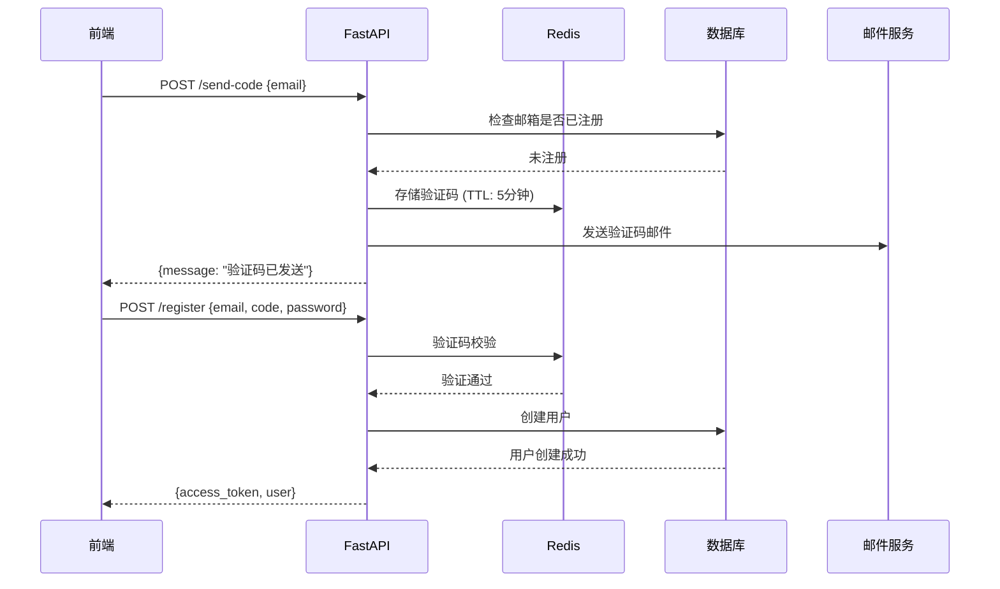

# 注册功能后端 API 开发设计文档

> **版本**：v1.0  
> **日期**：2024-12-17  
> **状态**：待评审

---

## 一、整体架构



---

## 二、发送验证码 API

### 2.1 API 规格

| 项目 | 说明 |
|------|------|
| **路径** | `POST /api/v1/auth/send-code` |
| **请求体** | `{ "email": "user@example.com" }` |
| **成功响应** | `{ "message": "验证码已发送" }` |
| **错误响应** | `400: 该邮箱已被注册` |

### 2.2 验证码存储方案对比

| 方案 | 优点 | 缺点 | 推荐 |
|------|------|------|------|
| **Redis** | 高性能、自带 TTL、分布式支持 | 需额外部署 | ⭐ 生产推荐 |
| 数据库 | 无额外依赖 | 性能差、需手动清理过期数据 | 小型项目 |
| 内存字典 | 最简单 | 重启丢失、不支持多实例 | 仅开发测试 |

### 2.3 Redis 存储方案详解

#### Docker 部署 Redis

```bash
# 1. 拉取 Redis 镜像
docker pull redis:7

# 2. 启动 Redis 容器
docker run -d \
  --name redis7 \
  -p 6379:6379 \
  -v redis_data:/data \
  redis:7 \
  redis-server --appendonly yes

# 3. 验证连接
docker exec -it redis7 redis-cli ping
# 返回 PONG 表示成功
```

#### Redis 验证码存储设计

**Key 设计**：
```
verify_code:{email} → {code}
```

**示例**：
```
verify_code:user@example.com → "123456"
TTL: 300秒 (5分钟)
```

**Python 操作示例**：

```python
import redis

# 连接 Redis
r = redis.Redis(host='localhost', port=6379, db=0, decode_responses=True)

# 存储验证码（5分钟过期）
def save_code(email: str, code: str) -> None:
    r.setex(f"verify_code:{email}", 300, code)

# 验证验证码
def verify_code(email: str, code: str) -> bool:
    stored = r.get(f"verify_code:{email}")
    return stored == code

# 删除验证码（验证成功后）
def delete_code(email: str) -> None:
    r.delete(f"verify_code:{email}")
```

#### FastAPI 集成 Redis

**1. 安装依赖**：

```bash
uv add redis
```

**2. 创建 Redis 连接（app/core/redis.py）**：

```python
import redis
from app.core.config import get_settings

settings = get_settings()

redis_client = redis.Redis(
    host=settings.REDIS_HOST,
    port=settings.REDIS_PORT,
    db=0,
    decode_responses=True
)

def get_redis() -> redis.Redis:
    return redis_client
```

**3. 配置文件添加（app/core/config.py）**：

```python
REDIS_HOST: str = "localhost"
REDIS_PORT: int = 6379
```

### 2.4 后端实现代码

```python
# app/api/v1/endpoints/auth.py

import random
from pydantic import EmailStr
from fastapi import Body, HTTPException

from app.core.redis import get_redis
from app.models.user import User

# 验证码配置
VERIFICATION_CODE_EXPIRE = 300  # 5分钟

@router.post("/send-code")
async def send_verification_code(
    email: EmailStr = Body(..., embed=True),
    db: Session = Depends(get_db),
):
    """发送邮箱验证码"""
    
    # 1. 检查邮箱是否已注册
    existing_user = db.query(User).filter(User.email == email).first()
    if existing_user:
        raise HTTPException(status_code=400, detail="该邮箱已被注册")
    
    # 2. 生成 6 位随机验证码
    code = ''.join(random.choices('0123456789', k=6))
    
    # 3. 存储到 Redis（5分钟过期）
    redis = get_redis()
    redis.setex(f"verify_code:{email}", VERIFICATION_CODE_EXPIRE, code)
    
    # 4. 发送邮件（见第三节）
    await send_verification_email(email, code)
    
    return {"message": "验证码已发送，请查收邮件"}
```

---

## 三、邮件系统对接

### 3.1 方案选择

| 方案 | 说明 | 推荐阶段 |
|------|------|----------|
| **控制台打印** | 开发测试用，打印到终端 | 开发阶段 ⭐ |
| SMTP | 自建邮件服务器或使用邮箱服务商 | 生产阶段 |
| 第三方服务 | SendGrid、Mailgun、阿里云邮件推送 | 生产阶段 |

### 3.2 开发阶段 Mock 实现

```python
async def send_verification_email(email: str, code: str) -> None:
    """发送验证码邮件（Mock 实现）"""
    print("=" * 50)
    print(f"📧 验证码邮件")
    print(f"收件人: {email}")
    print(f"验证码: {code}")
    print(f"有效期: 5分钟")
    print("=" * 50)
```

### 3.3 生产阶段 SMTP 实现

**1. 安装依赖**：

```bash
uv add aiosmtplib
```

**2. 配置（.env）**：

```env
SMTP_HOST=smtp.qq.com
SMTP_PORT=465
SMTP_USER=your_email@qq.com
SMTP_PASSWORD=your_smtp_password
SMTP_FROM_EMAIL=your_email@qq.com
```

**3. 邮件发送函数**：

```python
import aiosmtplib
from email.mime.text import MIMEText
from app.core.config import get_settings

async def send_verification_email(email: str, code: str) -> None:
    """发送验证码邮件"""
    settings = get_settings()
    
    message = MIMEText(f"您的验证码是：{code}，有效期5分钟。", "plain", "utf-8")
    message["From"] = settings.SMTP_FROM_EMAIL
    message["To"] = email
    message["Subject"] = "【InkFlow】邮箱验证码"
    
    await aiosmtplib.send(
        message,
        hostname=settings.SMTP_HOST,
        port=settings.SMTP_PORT,
        username=settings.SMTP_USER,
        password=settings.SMTP_PASSWORD,
        use_tls=True,
    )
```

---

## 四、改造注册 API

### 4.1 当前注册 API 分析

**现有接口**：`POST /api/v1/auth/register`

**现有请求体（UserCreate）**：
```python
{
    "username": "johndoe",      # 必填
    "email": "john@example.com", # 必填
    "password": "SecurePass123", # 必填
    "nickname": "John Doe"       # 可选
}
```

**问题**：
- 需要 username（改为邮箱注册后不需要）
- 没有验证码校验
- 返回格式需要调整

### 4.2 改造后的注册 API

**新请求体**：

```python
class RegisterRequest(BaseModel):
    email: EmailStr
    code: str = Field(..., min_length=6, max_length=6)
    password: str = Field(..., min_length=8)
```

**新响应体**：

```python
class RegisterResponse(BaseModel):
    access_token: str
    token_type: str = "bearer"
    user: UserResponse
```

**改造后的代码**：

```python
@router.post("/register", response_model=RegisterResponse)
async def register(
    email: EmailStr = Body(...),
    code: str = Body(...),
    password: str = Body(...),
    db: Session = Depends(get_db),
):
    """用户注册（验证码方式）"""
    
    # 1. 验证验证码
    redis = get_redis()
    stored_code = redis.get(f"verify_code:{email}")
    
    if not stored_code or stored_code != code:
        raise HTTPException(status_code=400, detail="验证码错误或已过期")
    
    # 2. 删除已使用的验证码
    redis.delete(f"verify_code:{email}")
    
    # 3. 检查邮箱是否已注册
    if db.query(User).filter(User.email == email).first():
        raise HTTPException(status_code=400, detail="该邮箱已被注册")
    
    # 4. 生成用户名和昵称
    username = f"user_{uuid.uuid4().hex[:8]}"
    nickname = f"用户_{random.randint(10000, 99999)}"
    
    # 5. 创建用户
    user = User(
        username=username,
        email=email,
        password_hash=hash_password(password),
        nickname=nickname,
        is_verified=True,  # 邮箱验证通过
    )
    db.add(user)
    db.commit()
    db.refresh(user)
    
    # 6. 生成 Token
    access_token = create_access_token(data={"sub": str(user.id)})
    
    return {
        "access_token": access_token,
        "token_type": "bearer",
        "user": user,
    }
```

### 4.3 Schema 改造

在 `app/schemas/user.py` 中添加：

```python
class RegisterRequest(BaseModel):
    """注册请求"""
    email: EmailStr
    code: str = Field(..., min_length=6, max_length=6, description="验证码")
    password: str = Field(..., min_length=8, description="密码")

class RegisterResponse(BaseModel):
    """注册响应（含 Token）"""
    access_token: str
    token_type: str = "bearer"
    user: UserResponse
```

---

## 五、前端对接开发

### 5.1 API 函数（utils/api.ts）

```typescript
// 类型定义
export interface SendCodeParams {
  email: string
}

export interface RegisterParams {
  email: string
  code: string
  password: string
}

export interface RegisterResponse {
  access_token: string
  token_type: string
  user: {
    id: string
    email: string
    nickname: string
    avatar: string | null
  }
}

// API 函数
export async function sendCodeApi(params: SendCodeParams): Promise<{ message: string }> {
  const response = await api.post('/auth/send-code', params)
  return response.data
}

export async function registerApi(params: RegisterParams): Promise<RegisterResponse> {
  const response = await api.post('/auth/register', params)
  return response.data
}
```

### 5.2 Auth Store 扩展（stores/auth.store.ts）

```typescript
// 用户类型扩展
interface User {
  id: string
  email: string
  username?: string
  nickname: string | null
  avatar: string | null
}

// 新增方法
function setTokenValue(newToken: string) {
  token.value = newToken
  setToken(newToken)
}

function setUserInfo(userInfo: User) {
  user.value = userInfo
}

// 导出
return {
  // ...existing
  setToken: setTokenValue,
  setUser: setUserInfo,
}
```

### 5.3 RegisterView 对接（替换 Mock）

```typescript
import { sendCodeApi, registerApi } from '@/utils/api'

// 发送验证码
const handleSendCode = async () => {
  if (!isValidEmail.value) return

  try {
    await sendCodeApi({ email: email.value })
    // 开始倒计时
    countdown.value = 60
    timer = window.setInterval(() => {
      countdown.value--
      if (countdown.value <= 0 && timer) {
        clearInterval(timer)
        timer = null
      }
    }, 1000)
  } catch (error) {
    console.error('发送失败:', error)
  }
}

// 注册提交
const handleRegister = async () => {
  if (!validateForm()) return

  isLoading.value = true
  try {
    const response = await registerApi({
      email: email.value,
      code: code.value,
      password: password.value,
    })
    
    authStore.setToken(response.access_token)
    authStore.setUser(response.user)
    router.push('/')
  } catch (error) {
    console.error('注册失败:', error)
  } finally {
    isLoading.value = false
  }
}
```

---

## 六、实现步骤清单

| #   | 任务               | 文件                                    | 复杂度 |
| --- | ---------------- | ------------------------------------- | --- |
| 1   | Docker 部署 Redis  | 终端                                    | ⭐   |
| 2   | 创建 Redis 连接模块    | `app/db/redis.py`                     | ⭐   |
| 3   | 配置 Redis 参数      | `app/core/config.py`                  | ⭐   |
| 4   | 实现 send-code API | `app/api/v1/endpoints/auth.py`        | ⭐⭐  |
| 5   | 添加注册相关 Schema    | `app/schemas/user.py`                 | ⭐   |
| 6   | 改造 register API  | `app/api/v1/endpoints/auth.py`        | ⭐⭐⭐ |
| 7   | 前端添加 API 函数      | `frontend/src/utils/api.ts`           | ⭐   |
| 8   | 扩展 Auth Store    | `frontend/src/stores/auth.store.ts`   | ⭐⭐  |
| 9   | RegisterView 对接  | `frontend/src/views/RegisterView.vue` | ⭐⭐  |
