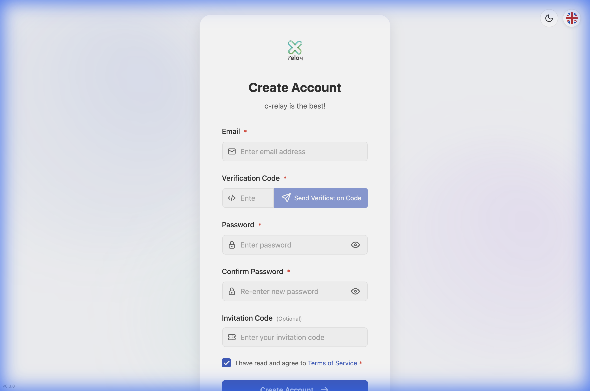
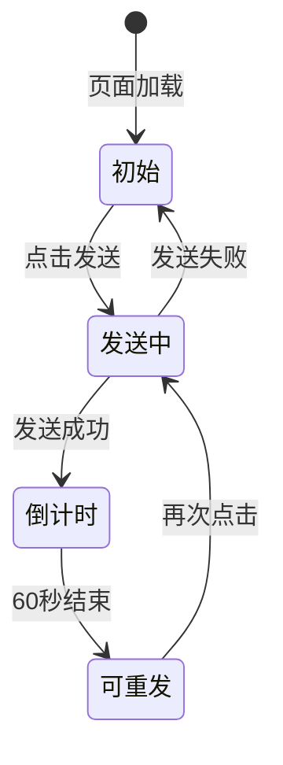
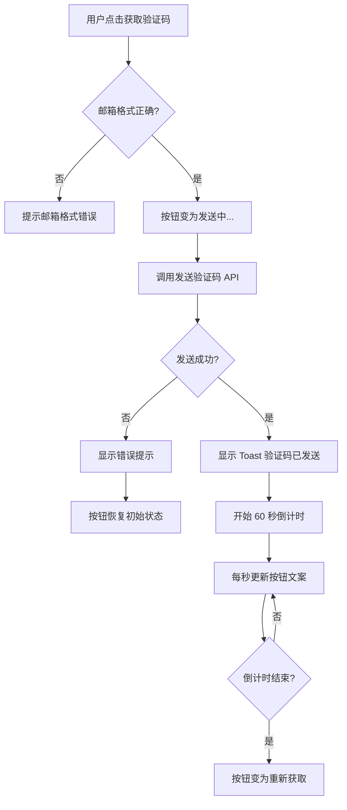
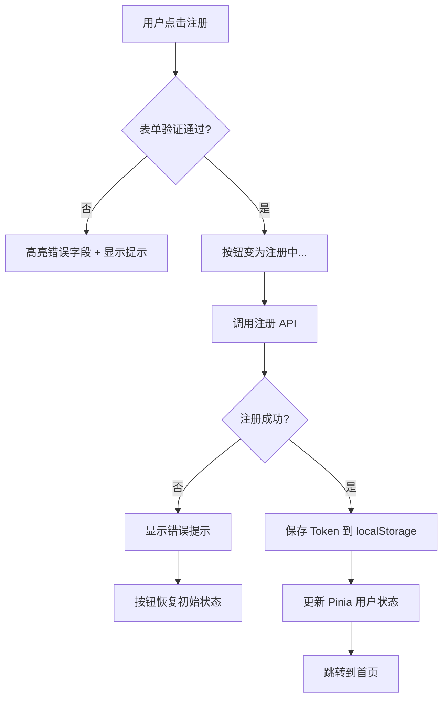

# 注册页面 UI 设计文档

> **文档版本**：v1.0  
> **创建日期**：2024-12-16  
> **参考设计**：[Crelay 注册页面](https://crelay.net/#/register)  
> **关联需求**：[注册功能 PRD](../../1-需求文档/02-注册功能PRD.md)  
> **状态**：待评审

---

## 1. 设计概述

本文档描述注册页面的前端 UI 设计，基于 Crelay 注册页面进行对标，复用登录页面的样式组件。

### 1.1 参考页面分析



**Crelay 注册页面特点**：

| 特性 | 描述 |
|------|------|
| **整体布局** | 与登录页一致的卡片式设计 |
| **表单字段** | 邮箱、验证码、密码、确认密码、邀请码（可选） |
| **验证码** | 输入框 + 发送按钮并排，倒计时显示 |
| **密码** | 带显隐切换图标 |
| **底部链接** | 「已有账户？立即登录」 |

### 1.2 我们的简化方案

| Crelay 原版 | 我们的实现 |
|-------------|------------|
| 邮箱 | ✅ 保留 |
| 验证码 + 发送按钮 | ✅ 保留（Mock 实现） |
| 密码 | ✅ 保留 |
| 确认密码 | ✅ 保留 |
| 邀请码 | ❌ 移除 |
| 服务条款勾选 | ❌ 移除 |

---

## 2. 页面布局

### 2.1 整体结构

```
┌────────────────────────────────────────────────────────────────┐
│                        [顶部工具栏]                              │
├────────────────────────────────────────────────────────────────┤
│                                                                 │
│              ┌─────────────────────────────────────┐            │
│              │                                     │            │
│              │         🖊️  InkFlow                │  Logo      │
│              │                                     │            │
│              │           创建账户                   │  主标题    │
│              │        填写信息完成注册              │  副标题    │
│              │                                     │            │
│              │  ✉️  [邮箱地址                  ]   │  邮箱      │
│              │                                     │            │
│              │  🔢  [验证码    ] [获取验证码/59s]  │  验证码    │
│              │                                     │            │
│              │  🔒  [密码                    👁]   │  密码      │
│              │                                     │            │
│              │  🔒  [确认密码                👁]   │  确认密码  │
│              │                                     │            │
│              │      [       注 册       →]        │  提交按钮  │
│              │                                     │            │
│              │      ───── 已有账户？ ─────         │  分隔线    │
│              │                                     │            │
│              │      [      立即登录      ]         │  登录链接  │
│              │                                     │            │
│              └─────────────────────────────────────┘            │
│                                                                 │
└────────────────────────────────────────────────────────────────┘
```

### 2.2 与登录页对比

| 区域   | 登录页            | 注册页          |
| ---- | -------------- | ------------ |
| Logo | ✅ BrandLogo 组件 | ✅ 复用         |
| 主标题  | 「登录账户」         | 「创建账户」       |
| 副标题  | 「请输入您的凭证继续」    | 「填写信息完成注册」   |
| 字段 1 | 邮箱             | 邮箱           |
| 字段 2 | 密码             | **验证码（新增）**  |
| 字段 3 | —              | 密码           |
| 字段 4 | —              | **确认密码（新增）** |
| 选项   | 记住我 + 忘记密码     | **无**        |
| 主按钮  | 登 录            | 注 册          |
| 分隔线  | 「还没有账户？」       | 「已有账户？」      |
| 底部链接 | 创建账户           | 立即登录         |

---

## 3. 组件设计

### 3.1 复用的组件

| 组件 | 来源 | 说明 |
|------|------|------|
| `BrandLogo` | `@/components/BrandLogo.vue` | Logo 展示 |
| `FormInput` | `@/components/FormInput.vue` | 表单输入框 |
| 按钮样式 | `@/styles/main.css` | `.btn-primary`, `.btn-secondary` |
| 卡片样式 | `LoginView.vue` | `.auth-card` |

### 3.2 新增的布局：验证码输入行

验证码字段需要特殊布局：**输入框 + 发送按钮并排**

```
┌─────────────────────────────────────────────────┐
│  🔢  [验证码         ]   [获取验证码]           │
│       ↑ 输入框               ↑ 发送按钮          │
│       flex: 1                width: auto        │
└─────────────────────────────────────────────────┘
```

**HTML 结构**：

```vue
<div class="form-group">
  <label><b>验证码</b></label>
  <div class="code-input-row">
    <FormInput v-model="code" placeholder="请输入验证码">
      <template #prefix><KeyRound :size="20" /></template>
    </FormInput>
    <button 
      type="button" 
      class="btn-send-code"
      :disabled="countdown > 0 || !isValidEmail"
      @click="handleSendCode"
    >
      {{ buttonText }}
    </button>
  </div>
</div>
```

**CSS 样式**：

```css
/* 验证码输入行：输入框 + 按钮并排 */
.code-input-row {
  display: flex;           /* 启用 Flex 布局 */
  gap: 12px;               /* 输入框与按钮间距 */
  align-items: stretch;    /* 子元素高度一致 */
}

/* 验证码输入框容器占据剩余空间 */
.code-input-row .form-input-wrapper {
  flex: 1;                 /* 占据剩余空间 */
}

/* 发送验证码按钮 */
.btn-send-code {
  min-width: 120px;        /* 最小宽度，保证按钮不会太窄 */
  white-space: nowrap;     /* 文字不换行 */
  padding: 0 16px;         /* 水平内边距 */
  border-radius: 8px;      /* 圆角与输入框一致 */
  font-size: var(--font-size-sm);
  font-weight: 500;
  cursor: pointer;
  transition: all 0.2s ease;
  
  /* 默认状态：品牌色边框 */
  background: transparent;
  border: 1px solid var(--color-primary);
  color: var(--color-primary);
}

/* 发送按钮 hover 效果 */
.btn-send-code:hover:not(:disabled) {
  background: var(--color-primary);
  color: white;
}

/* 发送按钮禁用状态（倒计时中） */
.btn-send-code:disabled {
  background: var(--color-bg-disabled);
  border-color: var(--color-border);
  color: var(--color-text-secondary);
  cursor: not-allowed;
}
```

---

## 4. 状态设计

### 4.1 验证码按钮状态



| 状态 | 按钮文案 | 样式 | 可点击 |
|------|----------|------|--------|
| **初始** | 获取验证码 | 蓝色边框 + 蓝色文字 | ✅（需邮箱格式正确） |
| **发送中** | 发送中... | 灰色背景 + Loading | ❌ |
| **倒计时** | 59s / 58s / ... | 灰色背景 + 灰色文字 | ❌ |
| **可重发** | 重新获取 | 蓝色边框 + 蓝色文字 | ✅ |

### 4.2 注册按钮状态

| 状态 | 按钮文案 | 样式 | 可点击 |
|------|----------|------|--------|
| **初始** | 注 册 | 蓝色背景 + 白色文字 | ✅ |
| **提交中** | 注册中... | 蓝色背景 + Loading 图标 | ❌ |

### 4.3 表单验证状态

| 字段 | 验证规则 | 错误提示 |
|------|----------|----------|
| 邮箱 | 非空 + 格式正确 | 「请输入正确的邮箱格式」 |
| 验证码 | 非空 + 6 位数字 | 「请输入 6 位验证码」 |
| 密码 | 非空 + ≥8 位 | 「密码至少 8 位」 |
| 确认密码 | 非空 + 与密码一致 | 「两次密码输入不一致」 |

---

## 5. 交互设计

### 5.1 验证码发送流程



### 5.2 注册提交流程



### 5.3 密码显隐切换

两个密码字段独立控制显隐状态：

```typescript
// 两个独立的显隐状态
const showPassword = ref(false)
const showConfirmPassword = ref(false)
```

---

## 6. 代码结构设计

### 6.1 文件结构

```
src/
├── views/
│   ├── LoginView.vue        # 登录页面（已有）
│   └── RegisterView.vue     # 注册页面（新增）
│
├── modules/auth/
│   ├── api.ts               # 新增 sendCode、register API
│   └── auth.store.ts        # 新增 register action
│
└── router/
    └── index.ts             # 新增 /register 路由
```

### 6.2 RegisterView.vue 结构

```vue
<script lang="ts" setup>
// ========== 1. 导入依赖 ==========
import BrandLogo from '@/components/BrandLogo.vue'
import FormInput from '@/components/FormInput.vue'
import { useAuthStore } from '@/modules/auth/auth.store'
import { ArrowRight, Eye, EyeOff, KeyRound, Loader2, LockKeyhole, Mail } from 'lucide-vue-next'
import { computed, onUnmounted, ref } from 'vue'
import { useRouter } from 'vue-router'

// ========== 2. 状态初始化 ==========
const authStore = useAuthStore()
const router = useRouter()

// 表单数据
const email = ref('')
const code = ref('')
const password = ref('')
const confirmPassword = ref('')

// 密码显隐状态
const showPassword = ref(false)
const showConfirmPassword = ref(false)

// 倒计时状态
const countdown = ref(0)
let timer: number | null = null

// 加载状态
const isLoading = ref(false)
const isSending = ref(false)

// 错误信息
const errorMessage = ref('')

// ========== 3. 计算属性 ==========
// 邮箱格式验证
const isValidEmail = computed(() => {
  return /^[^\s@]+@[^\s@]+\.[^\s@]+$/.test(email.value)
})

// 发送按钮文案
const sendButtonText = computed(() => {
  if (isSending.value) return '发送中...'
  if (countdown.value > 0) return `${countdown.value}s`
  return '获取验证码'
})

// ========== 4. 方法定义 ==========
// 发送验证码
const handleSendCode = async () => { ... }

// 表单验证
const validateForm = (): boolean => { ... }

// 注册提交
const handleRegister = async () => { ... }

// ========== 5. 生命周期 ==========
onUnmounted(() => {
  if (timer) clearInterval(timer)
})
</script>

<template>
  <!-- 与 LoginView.vue 结构一致 -->
</template>

<style scoped>
/* 复用登录页样式 + 新增验证码行样式 */
</style>
```

---

## 7. 复用与差异对照

### 7.1 可直接复用的代码

| 内容 | 来源 | 说明 |
|------|------|------|
| 页面容器样式 | `.auth-container` | 居中布局 |
| 卡片样式 | `.auth-card` | 白色圆角卡片 |
| 表单样式 | `.auth-form`, `.form-group` | 表单间距 |
| 按钮样式 | `.btn-primary`, `.btn-secondary` | 主次按钮 |
| 分隔线样式 | `.auth-divider` | 底部分隔 |
| 错误提示样式 | `.error-message` | 红色提示 |
| Loading 动画 | `.loading-icon` | 旋转动画 |

### 7.2 需要修改的内容

| 内容 | 登录页 | 注册页 |
|------|--------|--------|
| 标题 | 登录账户 | 创建账户 |
| 副标题 | 请输入您的凭证继续 | 填写信息完成注册 |
| 表单字段 | username, password | email, code, password, confirmPassword |
| 可选区域 | 记住我 + 忘记密码 | **删除** |
| 主按钮文案 | 登 录 | 注 册 |
| 底部提示 | 还没有账户？ | 已有账户？ |
| 底部链接 | 创建账户 → /register | 立即登录 → /login |

### 7.3 需要新增的内容

| 内容 | 说明 |
|------|------|
| 验证码输入行 | `.code-input-row` 布局 |
| 发送按钮 | `.btn-send-code` 样式 |
| 倒计时逻辑 | `countdown` + `setInterval` |
| 确认密码字段 | 第二个密码输入框 |
| 邮箱格式验证 | `isValidEmail` 计算属性 |
| 密码一致性验证 | `validateForm()` 中检查 |

---

## 8. 样式变量引用

注册页面使用的 CSS 变量（定义在 `main.css`）：

```css
/* 颜色变量 */
--color-primary: #3b82f6;           /* 主蓝色 */
--color-primary-hover: #2563eb;     /* hover 蓝 */
--color-text-primary: #1f2937;      /* 主文字 */
--color-text-secondary: #6b7280;    /* 次级文字 */
--color-border: #e5e7eb;            /* 边框色 */
--color-bg-card: #ffffff;           /* 卡片背景 */
--color-bg-disabled: #f3f4f6;       /* 禁用背景 */
--color-error: #ef4444;             /* 错误红 */

/* 尺寸变量 */
--font-size-sm: 0.875rem;           /* 14px */
--font-size-base: 1rem;             /* 16px */
--font-size-xl: 1.5rem;             /* 24px */
```

---

## 9. 实现清单

### 9.1 开发任务分解

| 序号 | 任务 | 难度 | 预计时间 |
|------|------|------|----------|
| 1 | 创建 `RegisterView.vue`，复制登录页结构 | ⭐ | 5 分钟 |
| 2 | 配置 `/register` 路由 | ⭐ | 2 分钟 |
| 3 | 修改标题和表单字段 | ⭐ | 10 分钟 |
| 4 | 添加验证码输入行布局 + CSS | ⭐⭐ | 15 分钟 |
| 5 | 实现倒计时逻辑 | ⭐⭐⭐ | 20 分钟 |
| 6 | 添加确认密码字段 + 显隐切换 | ⭐ | 10 分钟 |
| 7 | 实现表单验证逻辑 | ⭐⭐ | 15 分钟 |
| 8 | Mock 注册提交 + 自动登录 | ⭐⭐ | 15 分钟 |

### 9.2 技术难点

| 难点 | 说明 | 解决方案 |
|------|------|----------|
| **倒计时清理** | 组件卸载时需清理定时器 | `onUnmounted` 生命周期钩子 |
| **按钮状态管理** | 发送中/倒计时/可重发 | `computed` 计算属性 |
| **邮箱格式验证** | 发送前需验证邮箱 | 正则表达式 + `computed` |

---

## 10. 相关文档

- [注册功能 PRD](../../1-需求文档/02-注册功能PRD.md)
- [登录页面 UI 设计](../登录功能/登录页面UI设计.md)
- [技术选型和设计理念](../技术选型和设计理念.md)
