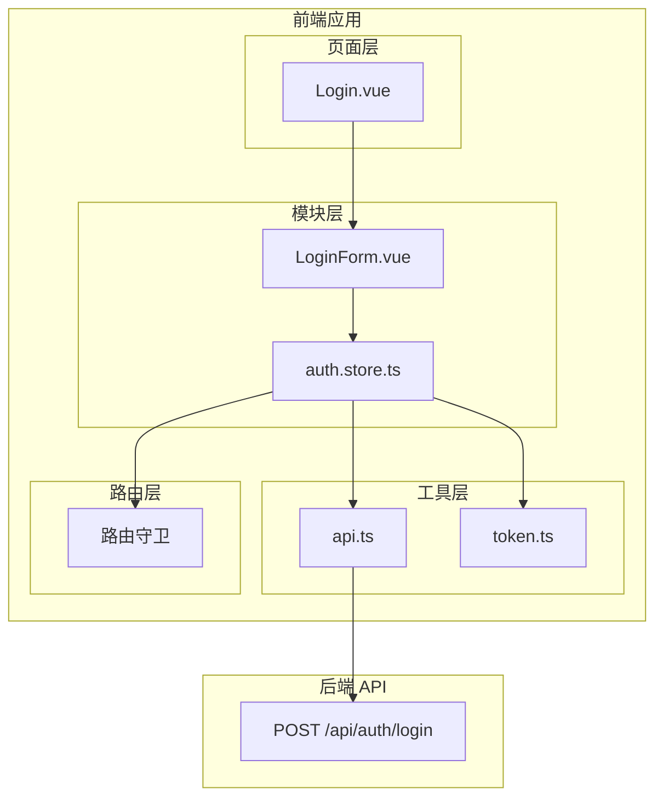
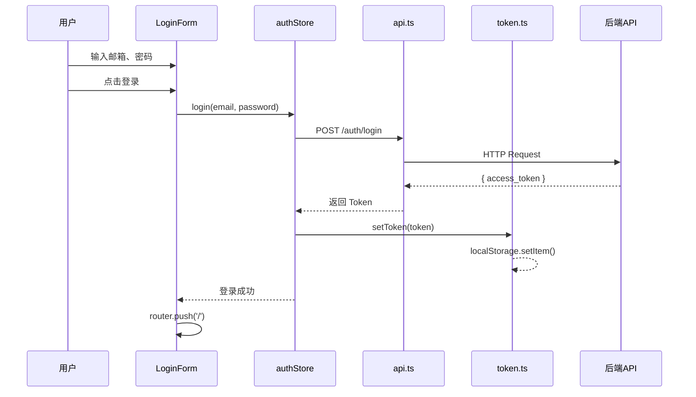
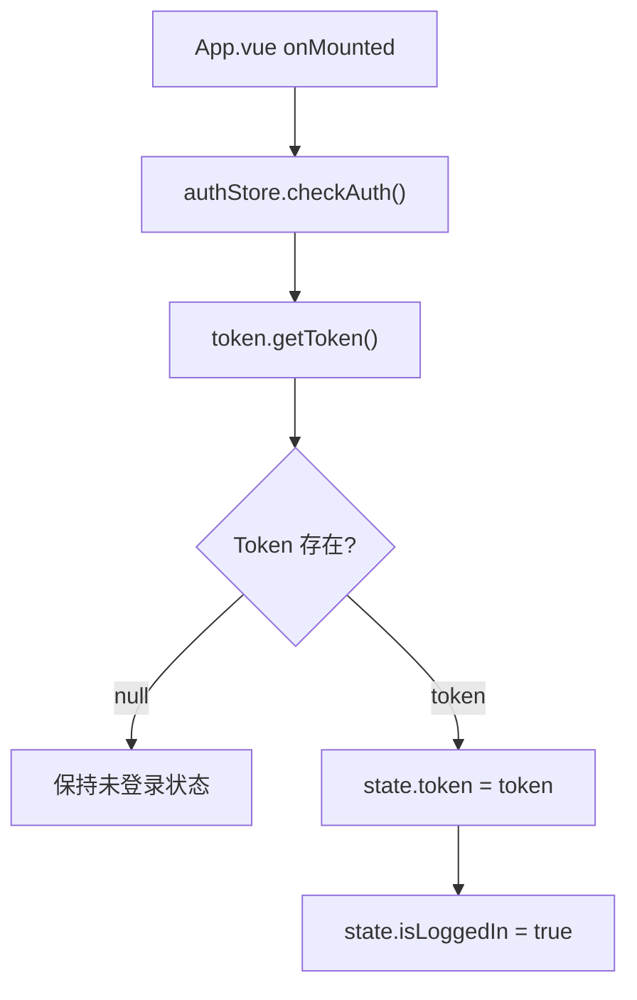

# 登录功能概要设计

> **文档版本**：v1.0  
> **创建日期**：2024-12-09  
> **需求文档**：[登录功能PRD](01-登录功能PRD.md)  
> **状态**：待评审

---

## 1. 设计目标

基于需求文档，设计登录功能的前端技术架构，实现：

- 用户登录表单及交互
- JWT Token 管理
- 全局登录状态管理
- 路由权限控制

---

## 2. 系统架构

### 2.1 整体架构



### 2.2 模块职责

| 模块           | 职责           | 位置                         |
| -------------- | -------------- | ---------------------------- |
| **Login.vue**  | 登录页面布局   | `views/Login.vue`            |
| **LoginForm**  | 登录表单组件   | `modules/auth/LoginForm.vue` |
| **auth.store** | 登录状态管理   | `modules/auth/auth.store.ts` |
| **api.ts**     | HTTP 请求封装  | `utils/api.ts`               |
| **token.ts**   | Token 读写工具 | `utils/token.ts`             |
| **路由守卫**   | 权限拦截       | `router/index.ts`            |

---

## 3. 详细设计

### 3.1 Token 管理（utils/token.ts）

**职责**：封装 localStorage 操作，统一管理 JWT Token

```typescript
// 接口定义
interface TokenService {
  getToken(): string | null
  setToken(token: string): void
  removeToken(): void
  isTokenValid(): boolean // 可选：检查过期
}
```

**存储位置**：`localStorage`  
**Key 名称**：`auth_token`

### 3.2 API 封装（utils/api.ts）

**职责**：创建 Axios 实例，配置请求/响应拦截器

```typescript
// 核心功能
1. 创建 Axios 实例（baseURL、timeout）
2. 请求拦截器：自动添加 Authorization Header
3. 响应拦截器：统一错误处理、Token 过期处理
```

**配置项**：

| 配置    | 值                               |
| ------- | -------------------------------- |
| baseURL | `/api` 或环境变量                |
| timeout | 10000ms                          |
| headers | `Content-Type: application/json` |

### 3.3 状态管理（modules/auth/auth.store.ts）

**职责**：使用 Pinia 管理全局登录状态

```typescript
// State
interface AuthState {
  user: User | null // 当前用户信息
  token: string | null // JWT Token
  isLoading: boolean // 登录中状态
}

// Actions
interface AuthActions {
  login(email: string, password: string): Promise<void>
  logout(): void
  checkAuth(): void // 检查本地 Token 并恢复状态
}

// Getters
interface AuthGetters {
  isLoggedIn: boolean // 计算属性：是否已登录
}
```

**初始化流程**：

```
App 启动 → checkAuth() →
  ├─ 有 Token → 恢复用户状态
  └─ 无 Token → 保持未登录
```

### 3.4 登录表单（modules/auth/LoginForm.vue）

**职责**：登录表单 UI + 交互逻辑

**组件结构**：

```vue
<template>
  <form @submit.prevent="handleSubmit">
    <!-- 邮箱输入 -->
    <input v-model="email" type="text" />
    <span v-if="errors.email">{{ errors.email }}</span>

    <!-- 密码输入 -->
    <input v-model="password" :type="showPassword ? 'text' : 'password'" />
    <button @click="togglePassword">👁</button>
    <span v-if="errors.password">{{ errors.password }}</span>

    <!-- 提交按钮 -->
    <button type="submit" :disabled="isLoading">
      {{ isLoading ? '登录中...' : '登录' }}
    </button>

    <!-- 全局错误 -->
    <div v-if="loginError">{{ loginError }}</div>
  </form>
</template>
```

**表单验证规则**：

| 字段     | 规则    | 错误信息    |
| -------- | ------- | ----------- |
| email    | 非空    | 请输入邮箱  |
| password | 非空    | 请输入密码  |
| password | 最少6位 | 密码至少6位 |

### 3.5 登录页面（views/Login.vue）

**职责**：页面布局，组合 LoginForm 组件

```vue
<template>
  <div class="login-page">
    <div class="login-card">
      <h1>欢迎登录</h1>
      <LoginForm @success="handleLoginSuccess" />
      <p>没有账号？<router-link to="/register">去注册</router-link></p>
    </div>
  </div>
</template>
```

### 3.6 路由守卫（router/index.ts）

**职责**：保护需要登录的页面

```typescript
// 路由元信息
meta: {
  requiresAuth: true
}

// 全局前置守卫
router.beforeEach((to, from, next) => {
  const authStore = useAuthStore()

  if (to.meta.requiresAuth && !authStore.isLoggedIn) {
    next({ path: '/login', query: { redirect: to.fullPath } })
  } else {
    next()
  }
})
```

---

## 4. 数据流设计

### 4.1 登录流程时序图



### 4.2 页面刷新恢复流程



---

## 5. 文件清单

| 文件路径                     | 类型 | 说明           |
| ---------------------------- | ---- | -------------- |
| `utils/token.ts`             | 新建 | Token 管理工具 |
| `utils/api.ts`               | 新建 | Axios 封装     |
| `modules/auth/index.ts`      | 修改 | 模块入口       |
| `modules/auth/auth.store.ts` | 新建 | Pinia Store    |
| `modules/auth/LoginForm.vue` | 新建 | 登录表单组件   |
| `views/Login.vue`            | 新建 | 登录页面       |
| `router/index.ts`            | 修改 | 添加路由和守卫 |

> [!NOTE]
> 注：学习阶段采用模块内聚的开发模式，以后需要全局复用再抽取出来
> ```
> src/modules/auth/
├── token.ts          # Token 读写工具
├── api.ts            # Axios 实例 + auth API
├── auth.store.ts     # Pinia 状态管理
├── LoginForm.vue     # 登录表单组件
└── index.ts          # 对外暴露的 API
> ```


---

## 6. 开发顺序

```
1. utils/token.ts      ─┐
                        ├─▶ 基础设施层
2. utils/api.ts        ─┘

3. auth.store.ts       ───▶ 状态管理层

4. LoginForm.vue       ─┐
                        ├─▶ UI 层
5. Login.vue           ─┘

6. 路由配置 + 守卫     ───▶ 路由层
```

---

## 7. 技术要点

### 7.1 Pinia 持久化

登录状态需要在页面刷新后恢复，方案：

- **方案 A**：手动在 `checkAuth()` 中从 localStorage 读取
- **方案 B**：使用 `pinia-plugin-persistedstate` 插件

**推荐**：方案 A（简单，易理解）

### 7.2 Token 过期处理

响应拦截器中检测 401 状态码：

```typescript
if (response.status === 401) {
  authStore.logout()
  router.push('/login')
}
```

### 7.3 登录成功跳转

支持跳转到原页面（从路由守卫拦截的情况）：

```typescript
const redirect = route.query.redirect as string
router.push(redirect || '/')
```

---

## 8. 风险与约束

| 风险点                       | 应对策略                                     |
| ---------------------------- | -------------------------------------------- |
| Token 存 localStorage 不安全 | 教学项目可接受，生产环境建议 httpOnly Cookie |
| 无 Token 刷新机制            | 后续可扩展 Refresh Token                     |
| 无密码加密                   | 依赖 HTTPS 传输加密                          |
