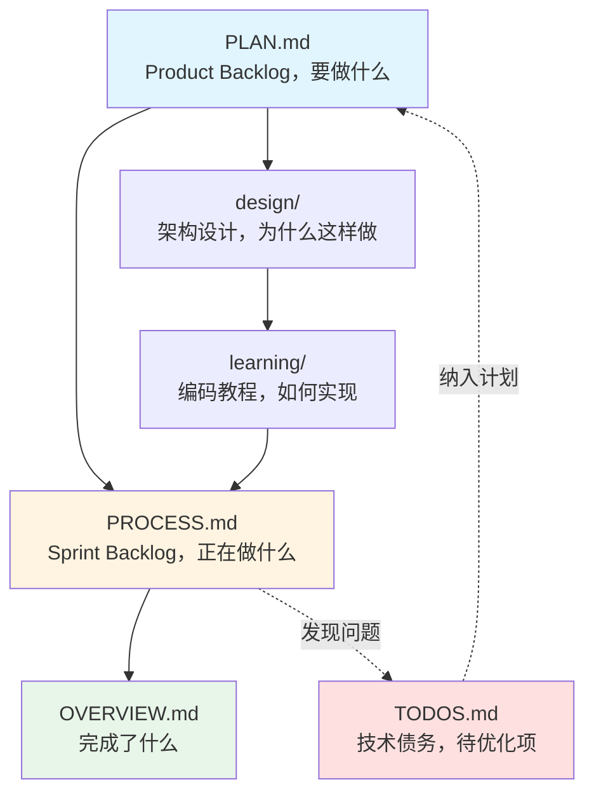

> 本目录是项目的**管理控制中心**，采用敏捷开发的文档体系。
> 目录包含**产品需求规格说明**、**阶段性任务分解**、**子任务实施步骤说明**、**已完成功能说明**和**遗留待办事项**

---

# 📚 核心文件说明

## 01-PLAN.md - 产品需求规格说明 📋

**职责**： Product Backlog（要做什么）

**内容**：
- 🎯 项目概览
- 📝 Phase 任务清单
- ⏱️ 预估工作量
- 🔑 预备知识

**更新时机**：项目开始前创建，需求变更和计划调整时更新

**典型内容**：
```markdown
# 前端开发学习计划

## 项目概览

描述项目目标、产品定位、核心功能、设计理念、技术栈、核心原则等

## 学习路径（预估单人实现天数）

1. 按照优先级制定每个Phase阶段要完成的核心功能（预估单人实现天数）
2. 描述每个Phase阶段的验收标准
3. 描述实现每个Phase阶段的关键步骤
4. 说明完成每个Phase需要的前置知识和学习资源链接
```

---
## 02-PROCESS.md - 当前Phase实现步骤 🔄

**职责**：Sprint Backlog（正在做什么）

**内容**：
- 🎯 当前 Sprint 需求说明
-  ✅ 已完成功能概述
- ❌ 下一步实施计划

**更新时机**：
1. phase阶段开始前, 覆盖更新「当前phase阶段目标」和「待实现功能」
2. 开始子任务前，更新「下一步实施计划」
3. 完成子任务后，更新「已完成功能」，标记「待实现功能」

**归档时机**：phase阶段全部完成后，将已完成功能归档到`04-OVERVIEW.md

**典型内容**：
```markdown
# 当前 Sprint 需求

说明当前阶段目标、开发形式(可选)、重难点(可选)等

## 已完成功能 

概述当前阶段已完成功能和对应的文件

## 待实现功能

用表格形式列举优先级、子任务、工时、依赖、状态等

## 下一步实施计划 

遵循由易到难、逐步深入的学习原则 和任务依赖关系规划下一步子任务的实现步骤
```

---
## 03-TASK.md - 复杂子任务实现步骤

**职责**：讲解复杂任务详细实现步骤（怎么实现）

**更新时机**：遇到复杂子任务时创建

---

## 04-OVERVIEW.md - 已完成功能概述

**职责**：记录项目所有已完成功能概览

**更新时机**：Phase 完成后更新，将PROCESS.md已完成功能说明剪切过来

**典型内容**：
```markdown
# ✅ 已完成功能
## Phase 1：搭建前端基础结构和设计系统 ✅
- 1. 开发环境搭建
- ✅ 数据库配置和迁移

## Phase 2：社交功能 ✅
- ✅ 通知系统（事件驱动、智能聚合）
...

# 📍 Next: 当前正在进行的Phase
```


---

## 05-TODOS.md  - 遗留任务清单

**职责**：记录临时发现的待办事项、技术债务、待优化项

**内容**：
- ⚠️ 代码质量问题
- 📝 遗留未完成功能
- 🔒 安全隐患
- 性能优化机会

**更新时机**：发现问题时立即添加

**典型内容**：
```markdown
- [x]  **SVG 图标替换** - 目前用的是 emoji，建议后面用专业 SVG 图标🔺 
- [ ] 🔺 **折叠状态持久化**（可选）- 目前折叠状态刷新后会重置，可以保存到 localStorage
```


---

#  🔗 文档关系图



**说明**：
1. **plan → design → learning → process -> task**：标准开发流程
2. **process → overview**：Phase 完成后总结
3. **process → todos**：开发中发现问题
4. **todos → plan**：技术债务纳入下一个 Phase

---

#  🎯 典型开发流程

```
1️⃣ 开始新的Phase
   └─ 初始化 PROCESS.md
      ├─ 从 plan 复制任务到 process（本周任务）
      ├─ 列出任务清单
      └─ 设定验收标准

2️⃣ 架构设计
   └─ 创建 design/phaseX_概设.md
      ├─ 技术选型（为什么选 A 不选 B？）
      ├─ 架构设计（模块划分、数据流）
      └─ 风险评估

3️⃣ 编码 + 学习
   └─ 根据agent指导编写代码
      └─对当前功能代码理解
         ├─ 快速完成
         └─ 标记 PROCESS.md 任务完成状态
      └─ 对当前功能代码不理解
         ├─ 创建 learning/**技术指南/.md
         └─ 创建 TASK.md, 按照指导一步步完成

4️⃣ phase完成
   ├─ 更新 OVERVIEW.md
   │  └─ 归档PROCESS.md 已完成功能到 OVERVIEW.md
   └─ 清空 PROCESS.md
      └─ 准备下一个 Sprint
```

---

**💡 提示**：将此 README 作为项目管理的"操作手册"！
